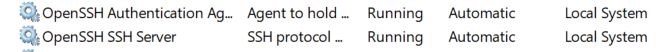
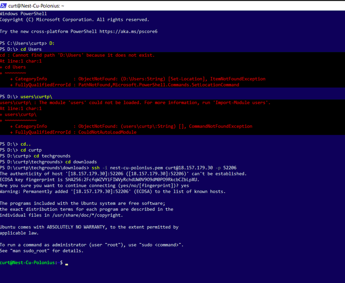
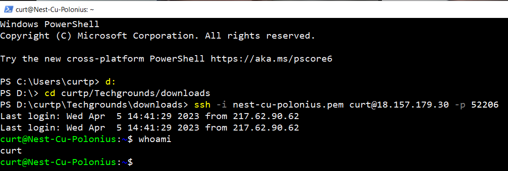

# Setting Up
In this task we had to make a SSH connection with our virtual Linux machine, using the username, SSH port, Servername and Authentication Key provided

## Key-terms
**SSH** 

Secure Shell or Secure Socket Shell, is a network protocol that gives users, particularly system administrators, a secure way to access a computer over an unsecured network.

**SSH Port**

The Default SSH port is port 22. But in this case we received a specific SSH port.

**Windows OpenSSH**

OpenSSH is a connectivity tool for remote sign-in that uses the SSH protocol. It encrypts all traffic between client and server to eliminate eavesdropping, connection hijacking, and other attacks.

**Key Authentication**

Public key authentication provides cryptographic strength that even extremely long passwords can not offer.

## Opdracht
- Make an SSH-connection to your virtual machine. SSH requires the key file to have specific permissions, so you might need to change those.

- When the connection is successful, type whoami in the terminal. This command should show your username.

### Gebruikte bronnen
https://www.youtube.com/watch?v=9dhQIa8fAXU

https://www.ssh.com/academy/ssh/public-key-authentication

### Ervaren problemen
I did not nessesarily run into a problem. It was just a matter of finding the right guide and information.

### Resultaat
Screenshot of the two OpenSSH services I had to start

Screenshot of the successful connection via SSH

Screenshot of the Whoami task

