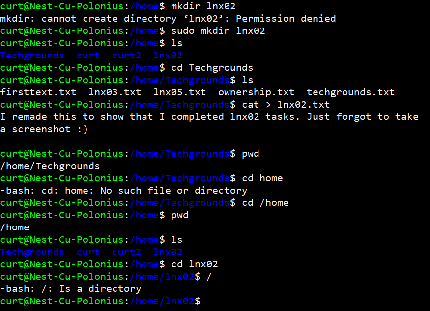

# Files and Directories
Folders in Linux are called directories. In this task we will be learning how to navigate through the Linux directories using the terminal.

## Key-terms
**Root Directory**

The root directory in Linux is represented by a slash ( / ). The root directory is the parent path to all files on the installation's partition.

**Home Directory**

The home directory in Linux is respresented by a tilde ( ~ ). The Linux home directory is a directory for a particular user of the system and consists of individual files. It is also referred to as the login directory, because it is the first place occurs after you login.

**Relative Path**

Relative path is defined as path related to the present working directory(pwd)

**Absolute Path**

An absolute path is defined as the specifying the location of a file or directory from the root directory(/). In other words we can say absolute path is a complete path from start of actual filesystem from / directory.

## Opdracht

- Find out your current working directory.

- Make a listing of all files and directories in your home directory.

- Within your home directory, create a new directory named ‘techgrounds’.

- Within the techgrounds directory, create a file containing some text.

- Move around your directory tree using both absolute and relative paths.

### Gebruikte bronnen
https://help.ubuntu.com/community/UsingTheTerminal

https://askubuntu.com/questions/617850/changing-from-user-to-superuser

### Ervaren problemen
Had some issues creating text as regular user. So was using root. This was later resolved when we gave the user rights to RW and Transfered ownership from root to the user.

### Resultaat
A screen shot of all the completed tasks

