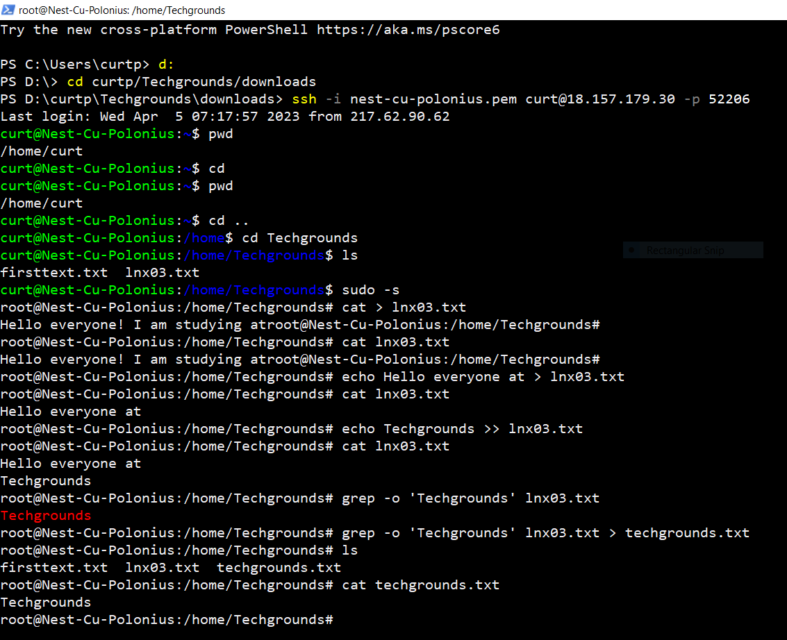

# Working With Text (CLI)
We will be using some new commands and using some text editors available. We will also get to use redirection.

## Key-terms
**STDIN**

The standard input device, also referred to as stdin , is the device from which input to the system is taken. Typically this is the keyboard, but you can specify that input is to come from a serial port or a disk file, for example.

**STDOUT**

The standard output device, also referred to as stdout, is the device to which output from the system is sent. Typically this is a display, but you can redirect output to a serial port or a file.

**MKDIR**

The command mkdir stands for “make directory”

**ECHO**

Echo is a Unix/Linux command tool used for displaying lines of text or string which are passed as arguments on the command line. This is one of the basic command in linux and most commonly used in shell scripts.

**Input/Output Redirection**

Input/Output (I/O) redirection in Linux refers to the ability of the Linux operating system that allows us to change the standard input ( stdin ) and standard output ( stdout ) when executing a command on the terminal.

## Opdracht

- Use the echo command and output redirection to write a new sentence into your text file using the command line. The new sentence should contain the word ‘techgrounds’.

- Use a command to write the contents of your text file to the terminal. Make use of a command to filter the output so that only the sentence containing ‘techgrounds’ appears.

- Read your text file with the command used in the second step, once again filtering for the word ‘techgrounds’. This time, redirect the output to a new file called ‘techgrounds.txt’.

### Gebruikte bronnen
https://www.ibm.com/docs/en/ibm-mq/8.0?topic=commands-standard-input-output

https://www.nielit.gov.in/gorakhpur/sites/default/files/Gorakhpur/Alevel_unix_21april20_AKM.pdf

ChatGPT

### Ervaren problemen
Still had some issues creating text as regular user. So was using root. This was later resolved when we gave the user rights to RW and Transfered ownership from root to the user.

### Resultaat
Screenshot of the whole completed tasks
