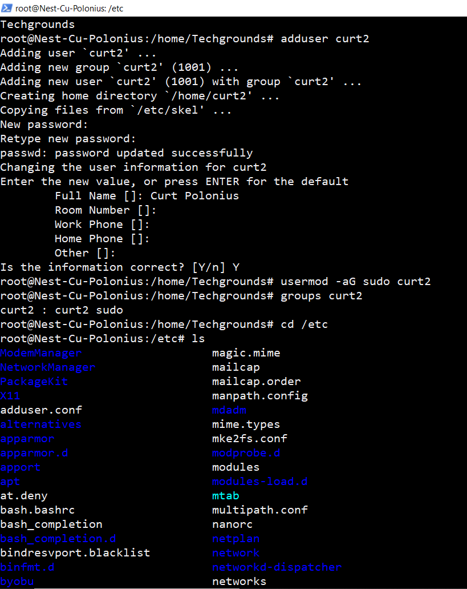
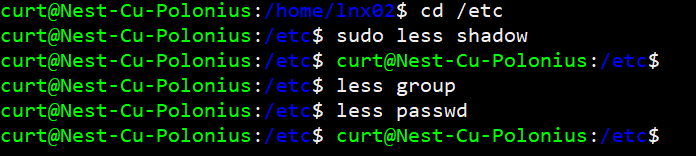

# Users and Groups
In this task we learned to create a new user and access the root user. We also learned to create groups and add users to them and give these groups rights. We also learned to access the directories that contain user information.

## Key-terms
**Users**

Users are simply the the people using the system. 

**Groups**

A group is typically a collection of users.

**Sudo**

Sudo stands for Super User Do. It is a command that gives users temporary root permissions, if the user has sudo rights. In the specific Linux version we are using, there is a sudo group which basically is the admin group.

**Root User**

A root user is the user that has permission to do anything on the system.

## Opdracht

- Create a new user in your VM. 

1. The new user should be part of an admin group.
2. The new user should have a password.
3. The new user should be able to use ‘sudo’

- Locate the files that store users, passwords, and groups. See if you can find your newly created user’s data in there.

### Gebruikte bronnen
https://askubuntu.com/questions/617850/changing-from-user-to-superuser

https://phoenixnap.com/kb/how-to-list-users-linux

ChatGPT

### Ervaren problemen
No real issues to report here

### Resultaat
Screenshot of successfully creating a new user and adding it to an admin group with sudo right.

Screenshot of the directories I accessed to view the user information.
