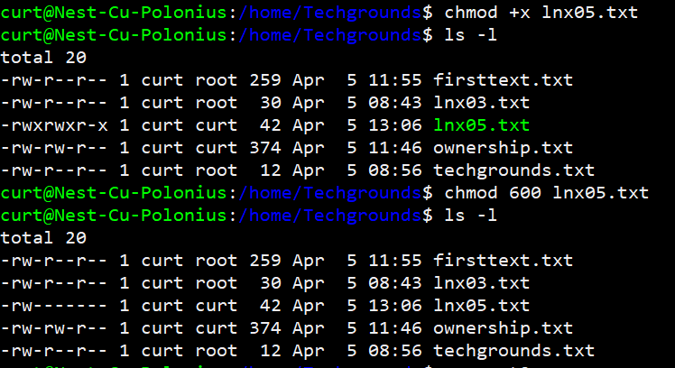

# File permissions
In this task we will learn how to give users and groups different permissions.

## Key-terms
**Long Listing**
A list which shows all the files, the owner, the group it is apart of and the rights the current user has with it. (ls -l)

## Opdracht
- Create a text file.
- Make a long listing to view the file’s permissions. Who is the file’s owner and group? What kind of permissions does the file have?
- Make the file executable by adding the execute permission (x).
- Remove the read and write permissions (rw) from the file for the group and everyone else, but not for the owner. Can you still read it?
- Change the owner of the file to a different user. If everything went well, you shouldn’t be able to read the file unless you assume root privileges with ‘sudo’.
- Change the group ownership of the file to a different group.

### Gebruikte bronnen
ChatGPT

### Ervaren problemen
No issues

### Resultaat
screenshot text file and long listing

screenshot x permission

screenshot ownership

screenshot group

