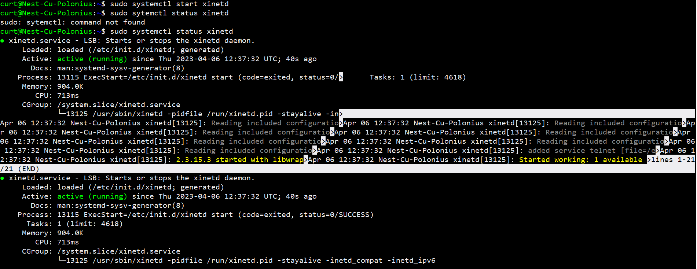
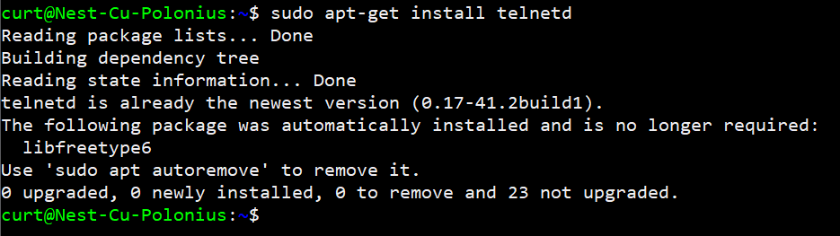
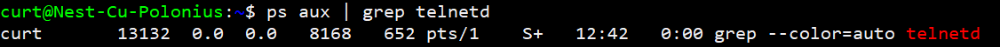
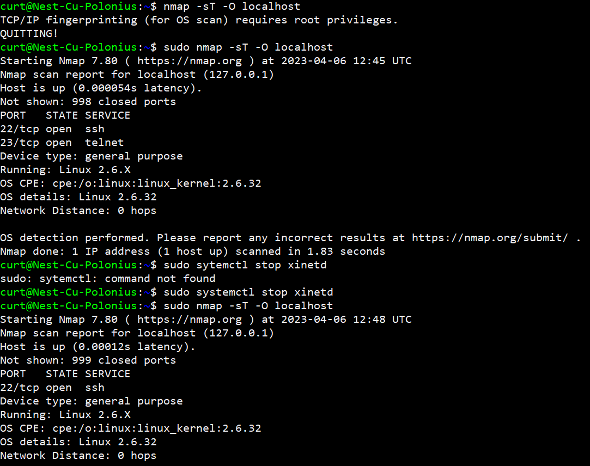
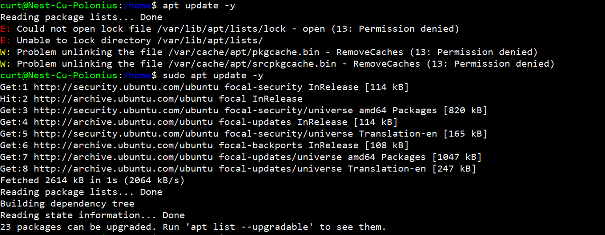
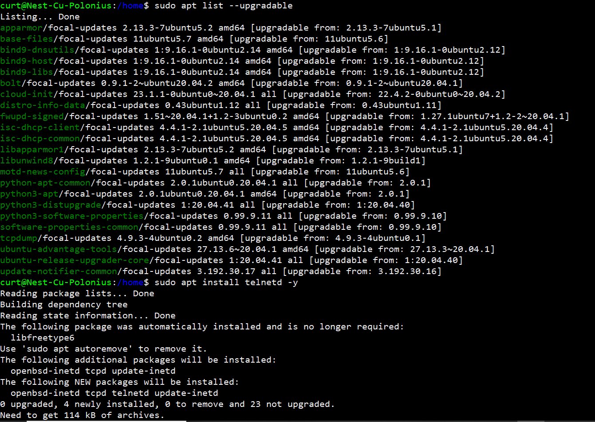
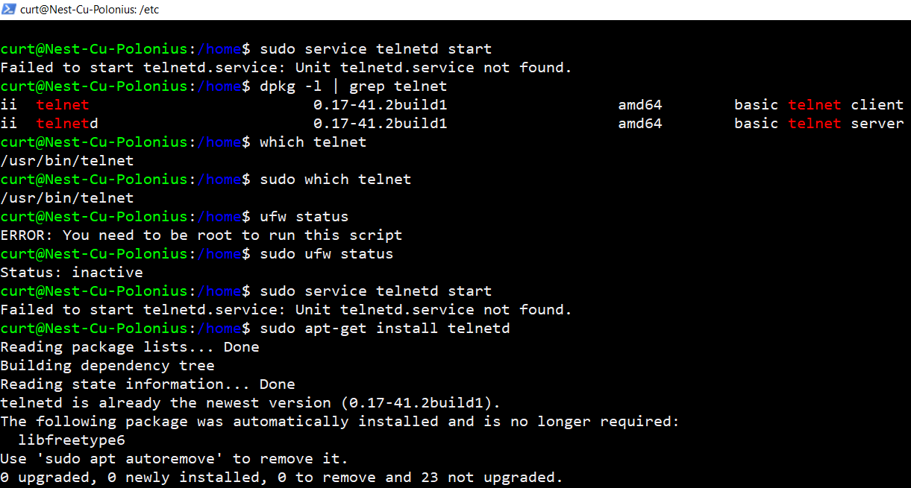
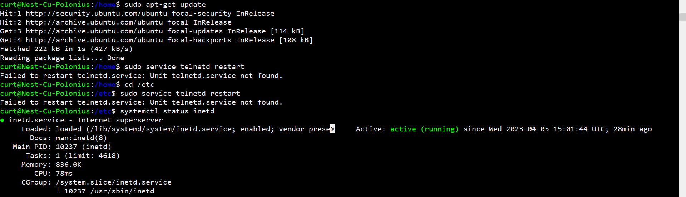
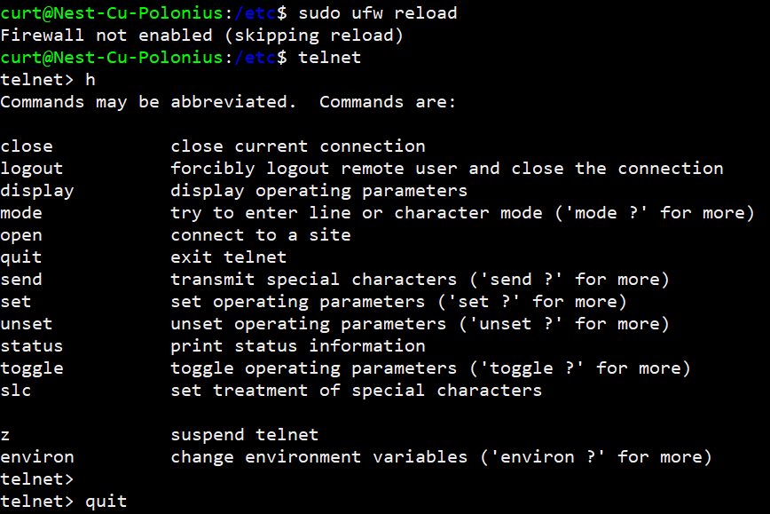

# Processes
In this task we will be working with processes in Linux and learn about the three categories they are split into: Daemons, Services, and Programs.
## Key-terms
**Daemons**

A daemon is also called background processes. It is a UNIX or Linux program that executes inside the background. Almost every daemon contains names that finish with "d" the letter.

**Services**

A service is a program that runs in the background outside the interactive control of system users as they lack an interface. This in order to provide even more security, because some of these services are crucial for the operation of the operating system.

**Programs**

A program is a sequence of instructions that are understandable by a computer's CPU (central processing unit) and that indicate which operations the computer should perform on a set of data.

## Opdracht

- Start the telnet daemon.
- Find out the PID of the telnet daemon.
- Find out how much memory telnetd is using.
- Stop or kill the telnetd process.

### Gebruikte bronnen
ChatGPT
https://www.freecodecamp.org/news/bash-scripting-tutorial-linux-shell-script-and-command-line-for-beginners/

https://www.cyberciti.biz/faq/how-do-i-turn-on-telnet-service-on-for-a-linuxfreebsd-system/

https://techjourney.net/how-to-check-if-telnet-is-running-on-a-server/

https://www.youtube.com/watch?v=aQYyngvXUCY

https://www.cyberciti.biz/faq/linux-find-process-name/

https://www.javatpoint.com/linux-telnet-command

### Ervaren problemen
I had a lot of problem with this task because some examples were talking about inetd but I had to use xinetd.

I also had to seperate telnet information from the daemon information and understand what they actually are.

### Resultaat
screenshot start

screenshot telnet install

screenshot grepPID

screenshot NMAP option

other lnx06 screenshots

