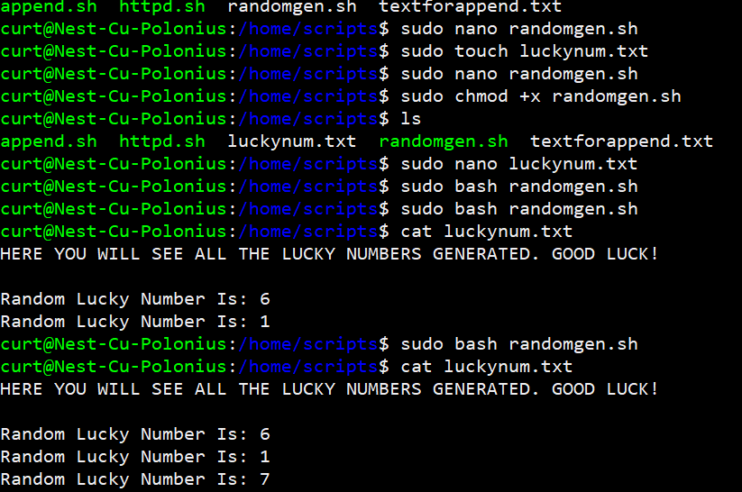

# Bash scripting
In the task we learned about Bash scripting. The default command line interface in Linux is called a Bash shell. Bash scripting is basically using script to automate some commands.

## Key-terms
**PATH**

PATH is an environment variable that instructs a Linux system in which directories to search for executables. The PATH variable enables the user to run a command without specifying a path

**Bash Scripting**

Bash scripting is a way to automate tasks which you need to execute on a computer. Put simply, a Bash script is just a collection of Bash commands which are kept in a text file.

## Opdracht
**Exercise 1:**
- Create a directory called ‘scripts’. Place all the scripts you make in this directory.
- Add the scripts directory to the PATH variable.
- Create a script that appends a line of text to a text file whenever it is executed.
- Create a script that installs the httpd package, activates httpd, and enables httpd. Finally, your script should print the status of httpd in the terminal.

**Exercise 2:**

- Create a script that generates a random number between 1 and 10, stores it in a variable, and then appends the number to a text file.

**Exercise 3:**

- Create a script that generates a random number between 1 and 10, stores it in a variable, and then appends the number to a text file only if the number is bigger than 5. If the number is 5 or smaller, it should append a line of text to that same text file instead.

### Gebruikte bronnen
ChatGPT

https://www.wikihow.com/Check-Path-in-Unix

https://linuxhint.com/bash_conditional_statement/

https://www.freecodecamp.org/news/bash-scripting-tutorial-linux-shell-script-and-command-line-for-beginners/#definition-of-bash-scripting

https://phoenixnap.com/kb/linux-add-to-path

https://ubuntu.com/tutorials/install-and-configure-apache#2-installing-apache

https://blog.eduonix.com/shell-scripting/generating-random-numbers-in-linux-shell-scripting/

https://www.tutorialspoint.com/guide-to-generate-random-numbers-in-linux

https://www.jdoodle.com/test-bash-shell-script-online/

### Ervaren problemen
No real problems here. I just had to manage my time between reading and testing the codes better.

### Resultaat
screenshot of the scripts directory

screenshot of adding the directory to PATH

screenshot append script

screenshot append script working

screenshot httpd script

screenshot httpd script working

screenshot httpd status

screenshot number generator script

screenshot number generator working

screenshot number higher than 5 script

screenshot higher than 5 script working

