# Cron Jobs
A Cron Job is a Linux command used for scheduling tasks to be executed sometime in the future. In short it automates these tasks based on the time period you set it on.

## Key-terms
**Cron**

In Unix and Linux, cron is a daemon, which is an unattended program that runs continuously in the background and wakes up (executes) to handle periodic service requests when required.

## Opdracht
- Create a Bash script that writes the current date and time to a file in your home directory.
- Register the script in your crontab so that it runs every minute.
- Create a script that writes available disk space to a log file in ‘/var/logs’. Use a cron job so that it runs weekly.

### Gebruikte bronnen
ChatGPT

https://www.cyberciti.biz/faq/linux-display-date-and-time/

https://www.cyberciti.biz/faq/unix-linux-getting-current-date-in-bash-ksh-shell-script/

https://www.ibm.com/docs/en/aix/7.2?topic=c-crontab-command

https://opensource.com/article/17/11/how-use-cron-linux

https://crontab.guru/

https://cronexpressiontogo.com/

https://crontab-generator.org/

https://www.geeksforgeeks.org/cron-command-in-linux-with-examples/

https://www.youtube.com/watch?v=llUw3RtD-Yw

### Ervaren problemen
I did receive a few problems here mainly with the second task. I could not make the cron run the script. The script itself worked just fine.

I then proceeded to go down a checklist of causes until I came across one. It went as followed.

I first checked to make sure that there was no synthax error with the cron command.

I then did a status check on cron

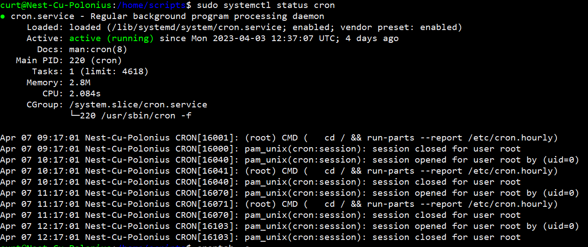

Followed by a log check

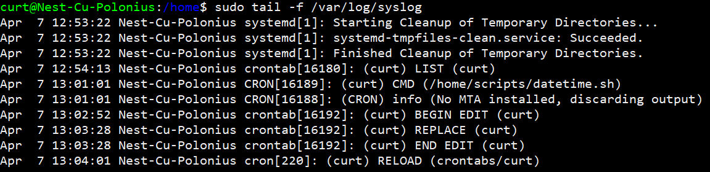

Then it became clear that my Cron expression was wrong

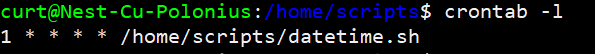

It was fixed by changing 1 * * * * to * * * * *, but the problems continued and it was still not posting.

I then tried checking that the Cron command line ends with a newline character. But this also did not fix the issue.

I then checked if maybe my user had rwx rights to the directory and files. I noticed then that the owner was listed as root on most of them so I switched ownership to my user. 

This was the solution to my problem. Seeing it started to work just fine after.

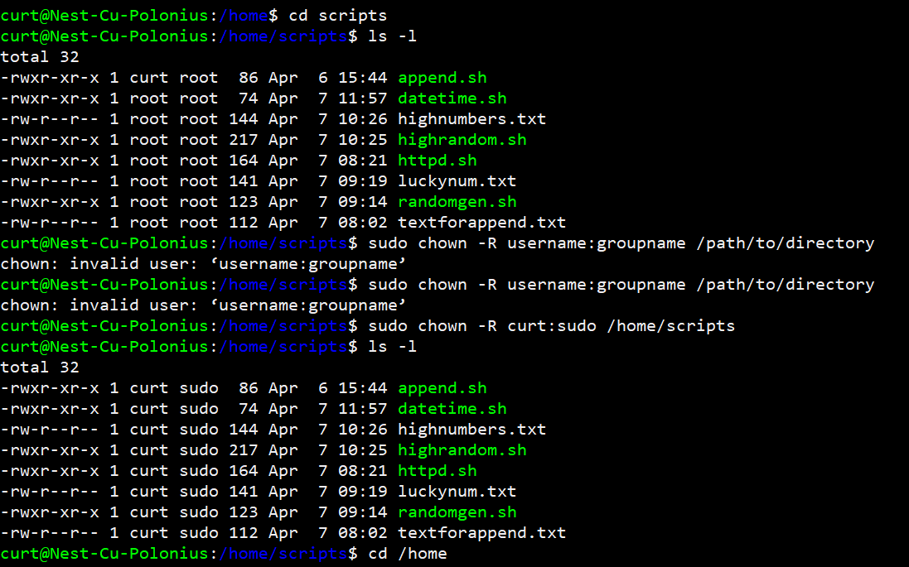

### Resultaat

screenshot bash script date and time

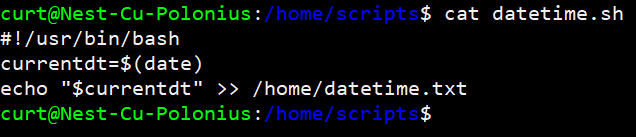

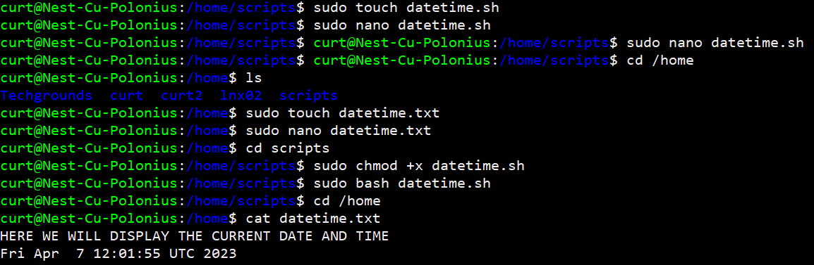

screenshot crontab registry and function

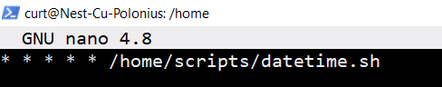

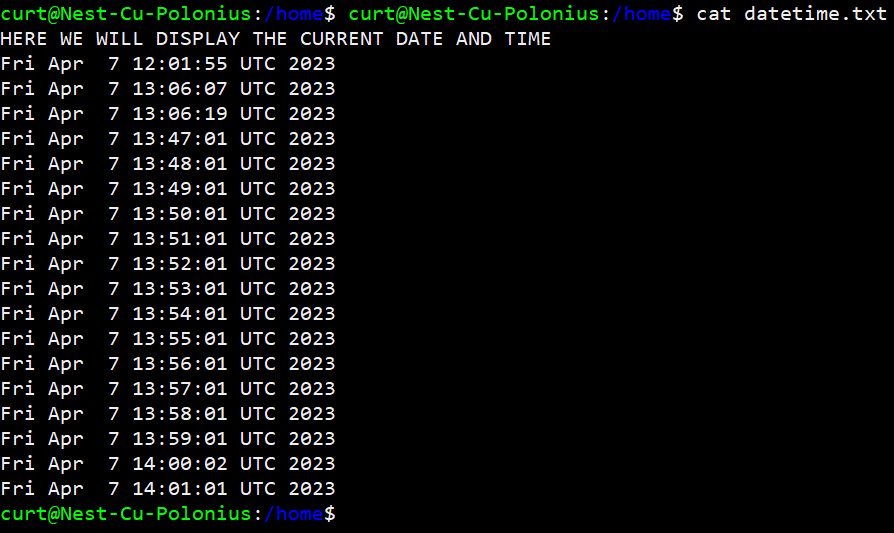

screenshot working second cron command. It was set to a minute just for testing.

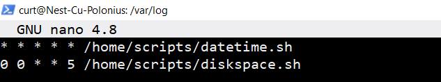

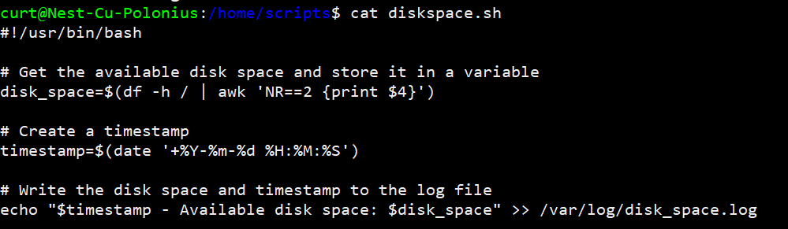

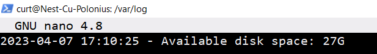

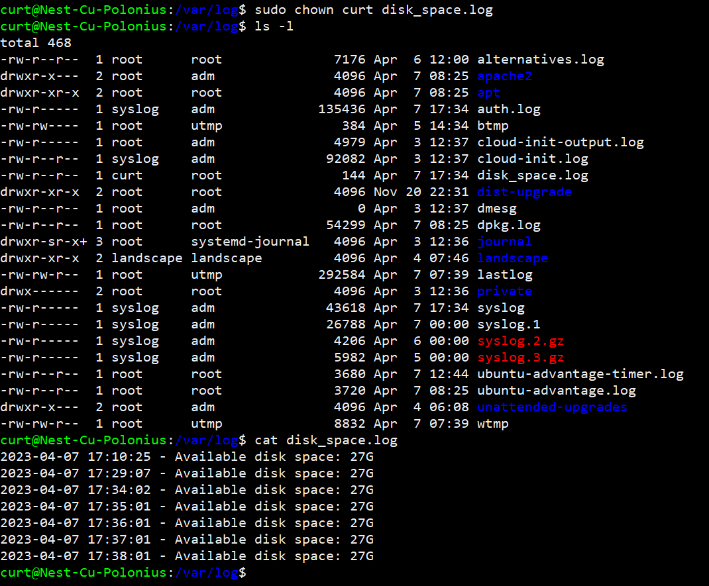

