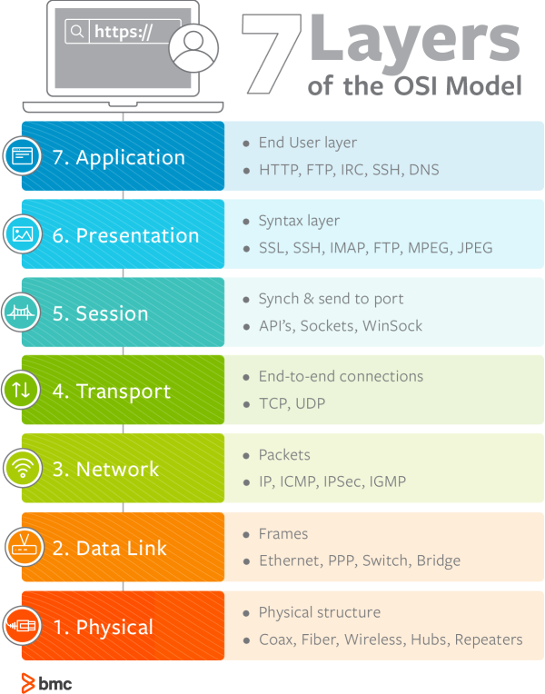
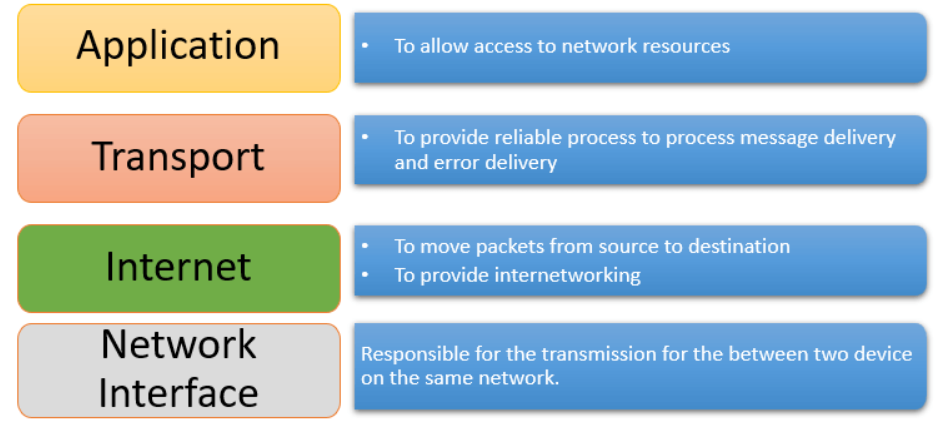
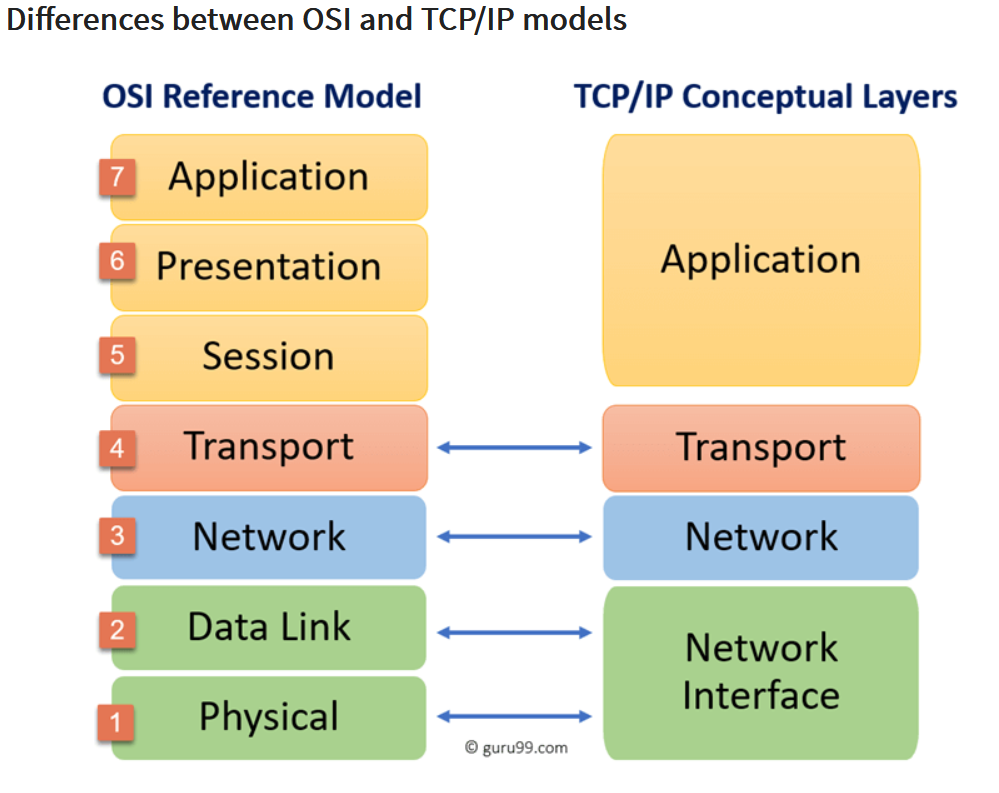

# OSI Stack
OSI Stack / OSI Model is a conceptual framework for understanding how communication systems operate. It has layers that define a set of rules and protocols for communication between computers in a network. The same counts for the TCP/IP Model.

## Key-terms
**OSI Model**

The Open Systems Interconnection (OSI) model is a conceptual framework for understanding how communication systems operate. It is a seven-layer model that defines a set of rules and protocols for communication between computers in a network. Each layer of the OSI model is responsible for a specific aspect of communication, from physical transmission to network routing and application-level protocols. The layers are organized in a hierarchical fashion, with each layer providing services to the layer above it and receiving services from the layer below it. The OSI model is an important reference point for network design and troubleshooting, as it provides a common language and framework for understanding network behavior and identifying problems.

**TCP/IP Model**

The Transmission Control Protocol/Internet Protocol (TCP/IP) model is a conceptual framework for how communication works on the Internet. It is a four-layer model that provides a set of rules and protocols for communication between devices connected to the Internet. The TCP/IP model has four layers: the Network Access layer, the Internet layer, the Transport layer, and the Application layer.

**Protocols**

In networking, a protocol is a standardized set of rules for formatting and processing data. Protocols enable computers to communicate with one another.

## Opdracht

- Study the OSI model and its uses.
- Study the TCP/IP model and its uses.

### Gebruikte bronnen
https://www.youtube.com/watch?v=3b_TAYtzuho

https://www.youtube.com/watch?v=LANW3m7UgWs

https://www.imperva.com/learn/application-security/osi-model/

https://www.bmc.com/blogs/osi-model-7-layers/

https://www.youtube.com/watch?v=OTwp3xtd4dg

https://www.geeksforgeeks.org/tcp-ip-model/

https://www.guru99.com/tcp-ip-model.html

https://www.cloudflare.com/learning/network-layer/what-is-a-protocol/

ChatGPT

### Ervaren problemen

No problems

### Resultaat
I came to understand that the OSI-Model is the old standard and is not used as much in practice as the TCP/IP Model.

The TCP/IP model is mostly used in practice because it was designed to work with the Internet, and it is the foundation for the modern Internet. The TCP/IP model is a simpler and more practical model compared to the OSI model, and it has become the de facto standard for network communication.

But the OSI Model provides a more detailed and comprehensive framework for understanding the functions of each layer of network communication. It can be useful for troubleshooting complex issues that involve multiple layers of the network, as it allows network administrators to isolate the source of the problem to a specific layer of the network.

Screenshot of the OSI-Model 

Screenshot of the TCP/IP Model

Screenshot of OSI vs TCP/IP Model

