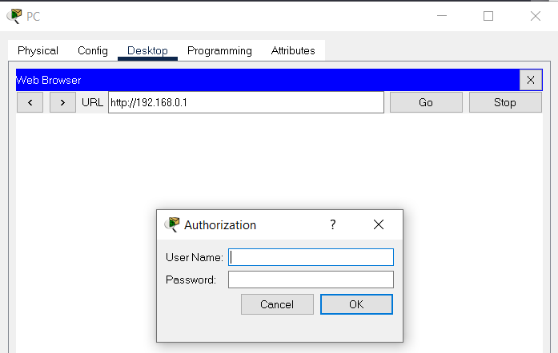
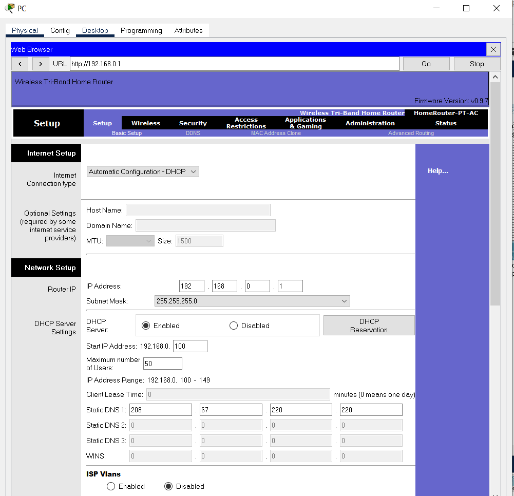
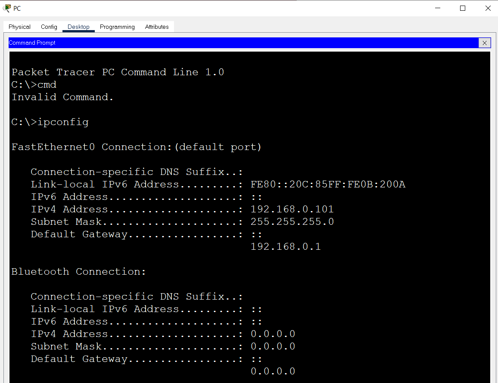
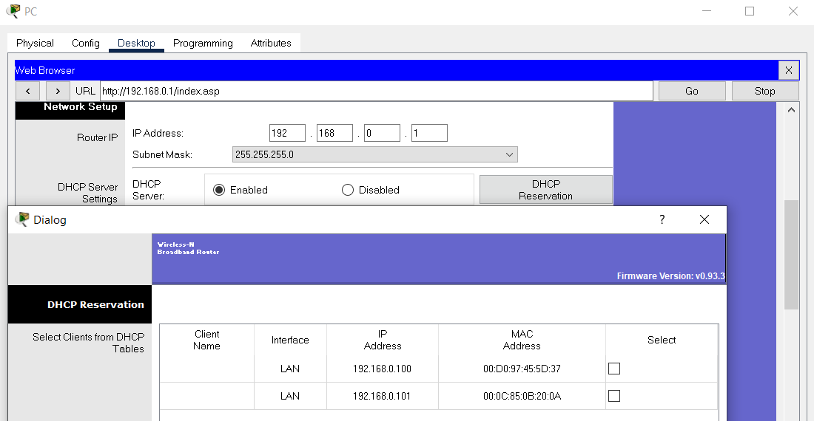
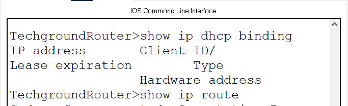
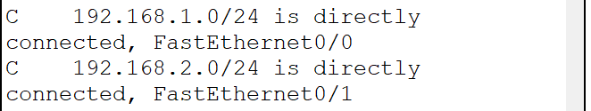
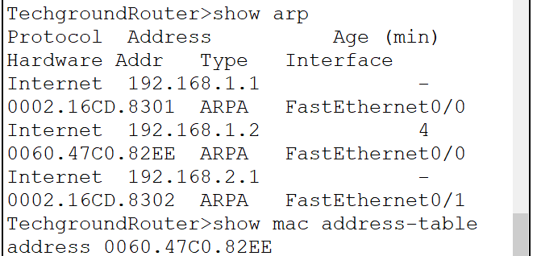
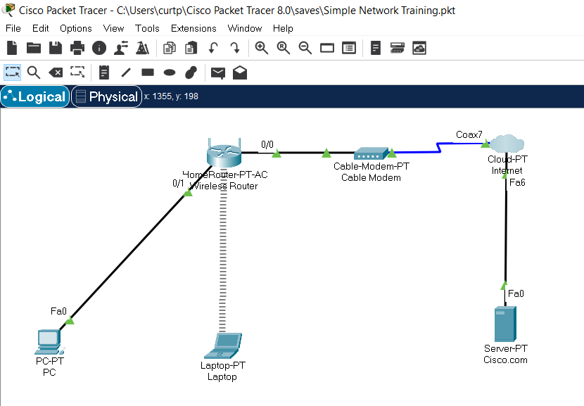
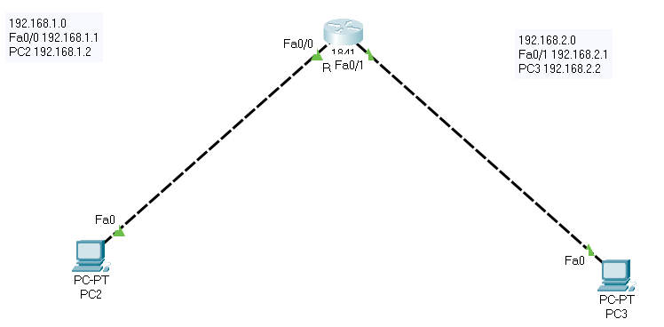

# Network Devices
Network devices are physical or virtual components that are used to facilitate communication and data transfer between computers or other devices on a network. These devices may be hardware or software-based and are designed to provide specific network functions such as routing, switching, forwarding, filtering, or security. 

## Key-terms
**Router**

**Switch**

**Repeaters**

**Access Point** 

## Opdracht

- Study Network Devices
- Study the OSI model's relation to these network devices

- Name and describe the functions of common network devices
- Most routers have an overview of all connected devices, find this list
- What other information does the router have about connected equipment?
- Where is the DHCP server on your network?
- What are your DHCP server configurations?

### Gebruikte bronnen
ChatGPT

https://www.forcepoint.com/cyber-edu/osi-model

https://community.fs.com/blog/tcpip-vs-osi-whats-the-difference-between-the-two-models.html

### Ervaren problemen
I did not have admin rights to the network I am on. But I resolved this by loading one on Cisco Packet Tracer and using it instead.

### Resultaat

# Network Devices & What They Do
**Router**

Devices that connect multiple networks and direct traffic between them.

**Switch**

Devices that connect devices on a network and enable them to communicate with each other.

**Repeaters**

Devices that amplify and regenerate signals to extend the reach of a network.

**Access Point** 

A networking hardware device that allows wireless devices, such as laptops, smartphones, and tablets, to connect to a wired network using Wi-Fi or other wireless communication standards.

**Hubs**

Devices that allow multiple devices to connect to a network and communicate with each other.

**Firewalls**

Devices that protect a network by controlling access to it and blocking unauthorized traffic.

**Load balancers**

Devices that distribute network traffic across multiple servers to ensure optimal performance and availability.

**Network interface cards (NICs)**

Hardware components that enable devices to connect to a network and communicate with other devices.

**Modems**

Devices that convert digital signals to analog signals for transmission over telephone lines.

**Repeaters**

Devices that amplify and regenerate signals to extend the reach of a network.

# Network Devices Location in The OSI-Model

    Routers: Layer 3 (Network layer)
    Switches: Layer 2 (Data Link layer)
    Hubs: Layer 1 (Physical layer)
    Firewalls: Layer 3 or Layer 4 (Network or Transport layer)
    Load balancers: Layer 4 or Layer 7 (Transport or Application layer)
    NICs: Layer 1 (Physical layer) and Layer 2 (Data Link layer)
    Modems: Layer 1 (Physical layer)
    Repeaters: Layer 1 (Physical layer)
    Access Points: Layer 1 (Physical layer) and Layer 2 (Data Link layer)
    Cables: Layer 1 (Physical layer)

# Router Information Methods

To find the information about all the devices that are connected to your router, you must first ensure that you are connected to your router to be able to login to your router's configuration page using it's IP-address.

This can be found either by looking at the back of your router for a physical lable or you can go into the CLI and type in ipconfig. The default gateway is your router's IP-address.

Below you will see the method of using the CLI to find the IP of your router.

Once you've logged in to your router's configuration page, look for a section called "Connected Devices," "Client List," or similar. For my particular case it was found in the DHCP Reservation section.

Another method is to use your router's CLI. (Note that I used another network to demonstrate this because the one I started with the router did not have a CLI.)

The first command

**"show ip dhcp binding"**

Is to show the IP-address if it was provided by a DHCP server. But seeing this new network did not use DHCP, I used the following command

**"show ip route"**

This shows the IP-addresses of the connected devices.

The **"show arp"** command showed the IP-address and MAC-address

Just for reference blow are the two virtual networks I used.

