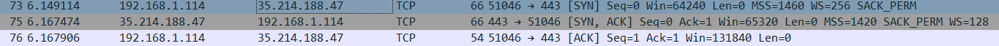

# Protocols
In IT, a protocol is a set of rules and procedures that govern the communication between different devices and systems. It defines the format, timing, sequencing, and error control of data transmission over a network or communication channel.

## Key-terms
**TCP**

TCP (Transmission Control Protocol) is a core communication protocol in the Internet protocol suite (TCP/IP) used for transmitting data between devices over the internet or other networks. It is responsible for breaking down large data streams into smaller packets, ensuring that they are delivered reliably, and in the correct order.

**Three-way Handshake**

The three-way handshake is a key process that occurs between two devices when establishing a TCP connection. It is a protocol used by TCP to initiate and terminate a connection between two devices.

    SYN: The first device (the client) sends a SYN (synchronize) packet to the second device (the server) to request a connection. The SYN packet contains a random sequence number that is used to synchronize the sequence numbers of both devices.

    SYN-ACK: The server responds with a SYN-ACK (synchronize-acknowledge) packet, which acknowledges the request and contains the server's own random sequence number. The server also sends an acknowledgment (ACK) of the client's sequence number, confirming that it has received the SYN packet.

    ACK: The client responds with an ACK packet, which acknowledges the server's sequence number. This completes the three-way handshake, and the connection is now established.

**UDP**

UDP (User Datagram Protocol) is a communication protocol in the Internet protocol suite (TCP/IP) that allows for the transmission of datagrams between devices over the internet or other networks. Unlike TCP, UDP is a connectionless protocol, meaning it does not establish a dedicated end-to-end connection before transmitting data.

UDP is designed for applications that require fast and lightweight data transmission, such as online gaming, video streaming, and real-time communication. It does not provide reliable data delivery or error correction, which means that packets may be lost, duplicated, or delivered out of order.

**HTTPS**

HTTPS (Hypertext Transfer Protocol Secure) is a protocol used for secure communication over the internet or other networks. It is an extension of the HTTP protocol used for website communication, with an added layer of security provided by the SSL/TLS encryption protocol.

**SSH**

SSH (Secure Shell) is a cryptographic network protocol used for secure remote access to devices over the internet or other networks. It provides a secure way to connect to a remote device, such as a server or network device, to execute commands or transfer files securely.

## Opdracht
- Identify several other protocols and their associated OSI layer. Name at least one for each layer.

- Figure out who determines what protocols we use and what is needed to introduce your own protocol.

- Look into wireshark and install this program. Try and capture a bit of your own network data. Search for a protocol you know and try to understand how it functions.

### Gebruikte bronnen
ChatGPT

Cisco Packet Tracer

https://www.internetx.com/en/news-detailview/who-creates-th

https://www.quora.com/How-would-one-create-and-implement-their-own-networking-protocol

https://www.youtube.com/watch?v=lb1Dw0elw0Q

### Ervaren problemen
No problems 

### Resultaat
**Physical Layer**

There are no formal protocols in the physical layer of the OSI model. However, there are some specifications and standards that define how this transmission occurs.

Ethernet (IEEE 802.3)

Wi-Fi (IEEE 802.11)

**Data Link Layer**

Point-to-Point Protocol (PPP)

Asynchronous Transfer Mode (ATM)

**Network Layer**

Internet Protocol (IP)

Internet Control Message Protocol (ICMP)

**Transport Layer**

Stream Control Transmission Protocol (SCTP)

Datagram Congestion Control Protocol (DCCP)

**Session Layer**

Session Initiation Protocol (SIP)

AppleTalk Session Protocol (ASP)

**Presentation Layer**

Hypertext Transfer Protocol (HTTP)

Simple Network Management Protocol (SNMP)

**Application Layer**

File Transfer Protocol (FTP)

Simple Mail Transfer Protocol (SMTP)

## Who Determines What Protocols We Use?

The selection and standardization of network protocols involve the contributions of multiple organizations

**The Internet Engineering Task Force (IETF)**

Is a standards development organization that focuses on Internet-related protocols. It defines the standards for many commonly used protocols

**the International Organization for Standardization (ISO)**

Is responsible for the development of international standards in many fields, including networking.

**The Institute of Electrical and Electronics Engineers (IEEE)**

Is also involved in networking standards and develops standards for a wide range of technologies, including wired and wireless networking, Ethernet, Wi-Fi, and Bluetooth.

**The Internet Assigned Numbers Authority (IANA)** 

On the other hand, is responsible for managing the allocation of IP addresses and domain names, which are critical components of the internet infrastructure. It also plays a role in maintaining the protocol registries used by IETF and other standards organizations.

## What is needed to introduce your own protocol?

    Define the problem: Determine the specific problem or need that your protocol will address. This might include issues with existing protocols, such as security vulnerabilities or lack of scalability.

    Design the protocol: Develop a detailed design for your protocol, including the various components, such as the packet format, data encoding, and error handling.

    Implement the protocol: Write the code for the protocol using a programming language such as C or Python. This will involve creating the various components of the protocol, such as the packet format, data encoding, and error handling.

    Test the protocol: Test the protocol to ensure it is functioning as expected and to identify any bugs or issues that need to be addressed.

    Deploy the protocol: Deploy the protocol in a test environment, and then in a production environment. This will involve configuring the necessary hardware and software, and training users on how to use the protocol.

## Understanding a protocol

I used wired shark to capture TCP Three-way handshake between my device and Techgrounds.nl. 

Explaining it as simple as possible, it goes as follows:

1. My Device is under the source IP and Techgrounds.nl is under the Destination IP. My device initiates a connection to Techgrounds.nl, it sends a SYN (Synchronize) packet with a randomly generated sequence number.

**The first SYN flag is normally set to 1 to indicate that the packet is a synchronization request. But in this case it is set to 0. When the client sets the sequence number to 0 in the first SYN packet, it is indicating to the server that it is willing to accept any initial sequence number chosen by the server. The server will then select a random initial sequence number, and include it in the ACK packet that it sends back to the client in response to the SYN packet.**

2. Techgrounds.nl is now under the source IP and my device is under the destination IP. It now sends a ACK (Acknowledgement) packet back to my device, to indicate it is willing to establish a connection. So it sends back it's own sequence number and set the ACK to 1.

3. To complete the three-way handshake, my device sends another ACK packet to the server, acknowledging the server's sequence number. This final ACK packet also contains data that can be used to send to the server immediately after the connection is established.

