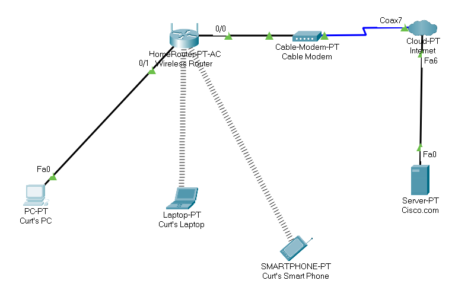
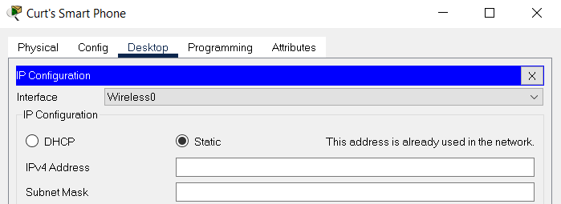
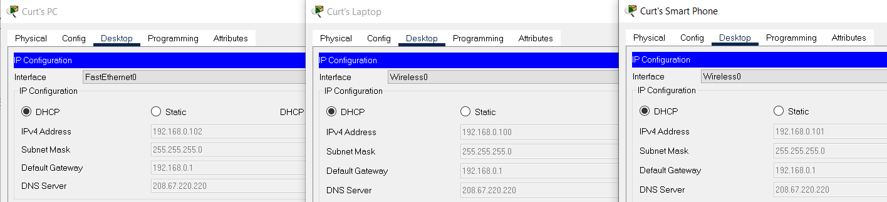
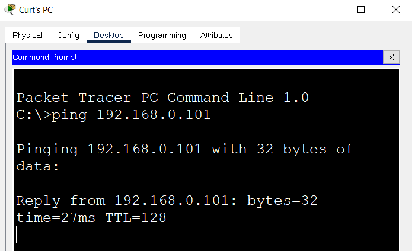
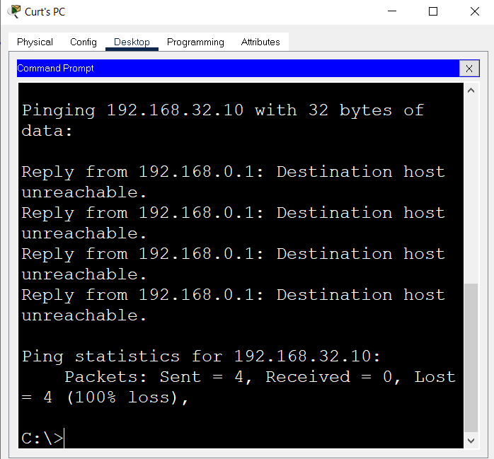
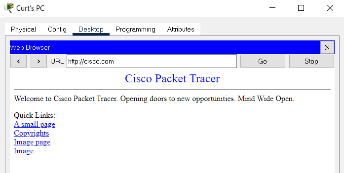
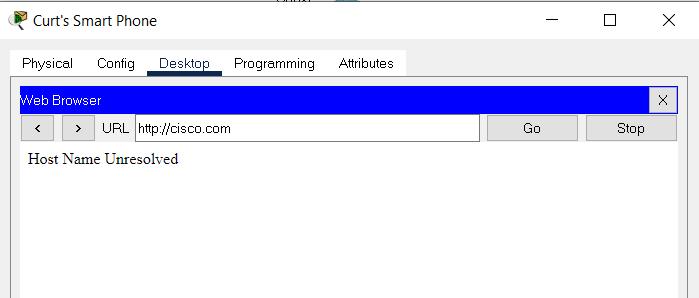

# IP Address
IP (Internet Protocol) address is a unique identifier that is assigned to every device connected to the internet. It consists of a series of numbers separated by dots and can be used to identify the location of a device on a network.

## Key-terms
**NAT-table**

A NAT (Network Address Translation) table, also known as a NAT mapping table, is a table that maps the private IP addresses of devices on a local network to public IP addresses used on the internet.

NAT is used to allow multiple devices on a local network to share a single public IP address for internet communication. When a device on the local network requests access to the internet, the NAT device, such as a router, replaces the source IP address of the packet with the public IP address of the NAT device.

## Opdracht
- Find out what your public IP address of your laptop and mobile phone is on wifi.
- Are the addresses the same or not? Explain why.
- Find out what your private IP address is of your laptop and mobile phone is on wifi.
- Are the addresses the same or not? Explain why.
- Change your phones private IP address to the one of your laptop. What happens?
- Try to change the private IP address of your phone to one outside the network. What happens?

### Gebruikte bronnen
[Plaats hier de bronnen die je hebt gebruikt.]

### Ervaren problemen
I have no admin access to the network so I am using Cisco Packet Tracer.

I also had to use other ways to display my public IP address on packet tracer compared to how I would in real life.

### Resultaat
1. To find my public IP address I used https://www.whatismyip.com/ , but also tested out the CLI option command: **"nslookup myip.opendns.com resolver1.opendns.com"**

2. The public IP address of both my phone and laptop are the same because a public IP address is a unique IP address asigned to my network by the ISP (Internet Service Providor). When a device on the network sends data to the internet, the router or modem replaces the private IP address with the public IP address before sending it to the internet.

3. To find my private IP address on my phone and laptop, I used a combination of ipconfig, checking my phone's Wi-Fi settings and seeing it under the IPV4 section or you can also do it by logging in your router and finding the device list.

4. My device's private IP addresses are not the same. They need to be different so they can have their unique identity on the network.

Screenshot of my packet tracer network

5. We should never have two devices on the same network with the same IP address, seeing this would cause conflicts. This means that both devices would be unable to communicate properly on the network because the network would not know which device to send data to.

Below you will see that when I tried to give the smartphone the same IP as the laptop, I received the following message.

6. When I changed the phone's IP to one outside the network, I lost the ability to use my router for internet connectivity. I also lost the ability to connect to devices that are still on the network.

screenshot of all devices on the same network

screenshot of the PC being able to ping the phone

screenshot of the PC trying to ping the phone outside the network

screenshot of the PC still being able to use the router and modem to access cisco.com

screenhot of the Phone unable to use the router and modem to access cisco.com seeing it is not in the network

