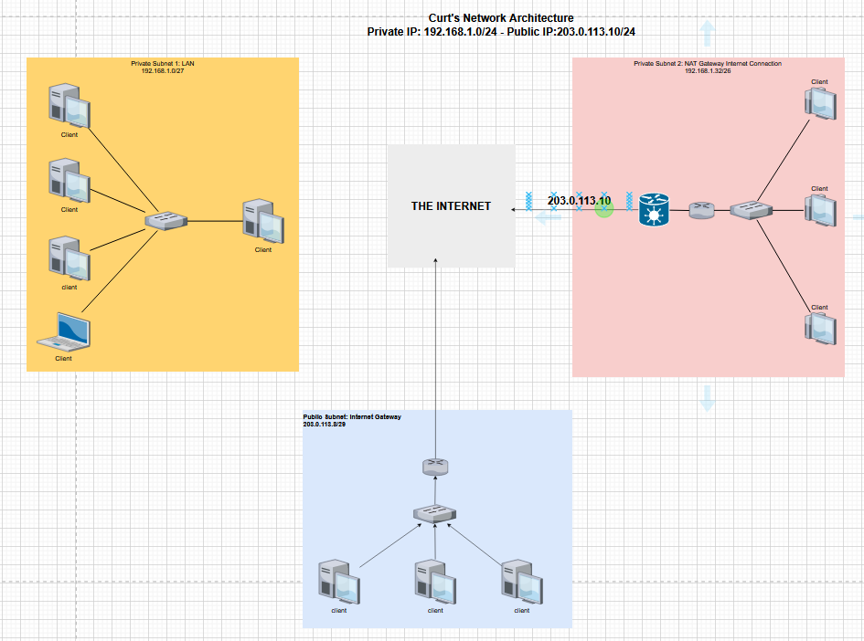

# Subnetting
Subnetting is the process of dividing a large network into smaller sub-networks, called subnets. The primary purpose of subnetting is to improve network performance and security by reducing network traffic and isolating groups of devices.
## Key-terms
**LAN**

A LAN, or Local Area Network, is a computer network that covers a small geographic area, typically within a single building or campus. A LAN is used to connect computers, servers, printers, and other network devices together so that they can communicate with each other and share resources.

**Subnet Mask**

A subnet mask is a 32-bit number that is used to divide an IP address into two parts: the network part and the host part. 

**Prefix**

A network prefix, or simply prefix, is a notation used in IP networking to indicate the size of the network part of an IP address. The prefix is represented as a number that indicates the number of bits in the network part of the address. For example, a prefix of /24 indicates that the first 24 bits of the IP address represent the network part.

**CIDR notation**

CIDR notation, or Classless Inter-Domain Routing notation, is a compact way of representing IP addresses and their associated network prefixes. It is used to specify the network portion and host portion of an IP address, as well as the subnet mask, in a concise and standardized format.

For example IP address: 192.168.10.18 Submask: 255.255.255.0, can also be written as 192.168.10.18/24

IP address: 192.168.1.1 Submask: 255.255.0.0, can also be written as 192.168.1.1/16.

## Opdracht
Create a network architecture that meets the following requirements:

- 1 private subnet that can only be reached from within the LAN. This subnet must be able to accommodate a minimum of 15 hosts.

- 1 private subnet that has internet access through a NAT gateway. This subnet must be able to place at least 30 hosts (the 30 hosts does not include the NAT gateway).

- 1 public subnet with an internet gateway. This subnet must be able to place at least 5 hosts (the 5 hosts does not include the internet gateway).

Plaats de architectuur die je hebt gemaakt inclusief een korte uitleg in de Github repository die je met de learning coach hebt gedeeld.
### Gebruikte bronnen
ChatGPT

https://www.udemy.com/course/complete-networking-fundamentals-course-ccna-start/

http://learnccna.net/ip-subnet-calculator-2/D8A43B6EE6F0CC30DD82E359FBE9743454B8F5098894BB9384B6832A02D2234D49DE839783CA5A55A2F46F4518DD765B/?net_class=A

https://davidbombal.com/subnetting-concepts-calculator/

https://www.solarwinds.com/free-tools/advanced-subnet-calculator?CMP=BIZ-TAD-DBMBL-SW_WW_X_PP_PPD_FT_EN_TOPFT_SW-SUB-X_X_X_X-Q416

### Ervaren problemen
Main problem was myself trying to overthink the task. I had to move back and try to keep it much simpler. I t

### Resultaat

When it came to the first task I took these following steps:

1. I figured out all I really needed is a switch or a hub to connect all these host devices into a LAN.

2. It had to be a private subnet so I took the following IP address of 192.168.1.0/24 and split it into a subnet of 192.168.1.0/27. I figured this out by using the following equation: **hosts = 2^n - 2** with n being the number of binary bits in the host portion. This way I figured out that in order to accommodate minimal 15 hosts I needed 32 addresses, which only 30 will be usable for the host devices. If I had picked /28 I would have had 16 addresses with only 14 being usable for the host devices and that is not enough. The -2 is for the subnet and the broadcast address.

When it came to the second task I took the following steps:

1. I took into account that the only differences between this private subnet and the one in the first task is that this one needs to connect to the internet via a NAT gateway and it needs more hosts.

2. I found out that I can create a larger subnet by combining smaller subnets together. So I took the second and third subnet I created in the split earlier and combined them together. So I took 192.168.1.32/27 and 192.168.1.64/27 and combined them to get 192.168.1.32/26. When you combine these two subnets, you "borrow" one more bit from the host portion of the address, effectively creating a larger subnet with a /26 subnet mask.

3. With the subnet 192.168.32/26 I have 64 address, which 62 is usable for the host devices. Two will be reserved for the subnet address and the broadcast address.

4. I then connected all the devices via a switch, connect the switch to a router and the router to the NAT gateway which will translate the private IP addresses into public IP addresses add an extra layer of security by  hiding the private IP addresses of devices within the private network from the public network, and vice versa.

When it come to the third task I assumed that I had received a public IP from my ISP, which I am allowed to subnet and did the following:

1. I took the IP 203.0.113.10/24 and broke it down to smaller subnets.

2. To find out how many host portion bits I need to steal to acccommodate 5 hosts, I used the formula hosts = 2^n -2. So I did 2^3 = 8, 8 - 2 = 6. If I do 32 bits - those 3 bits I get 29 bits. So I know it will be a /29.

3. I also knew that then the split between the network portion and host portion, happens in the 4th octet. So I converted just the 4th octet into binary. 203.0.113.00001010 and counted from right to left 3 bits (these will form the host portion) 203.0.113.00001**010**.

4. With my new network portion and host portion known, I have my subnet of 203.0.113.8/29

5. I then connected the hosts via a switch and the switch to the internet gateway

