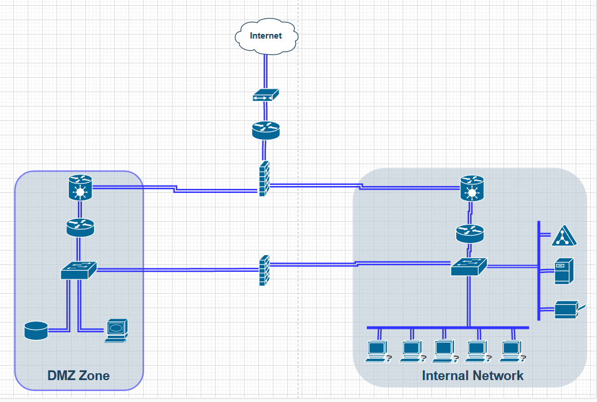

# Networking Case Study
We have to do a tasks out of a network case study by using all the aspects we learned during week 2 Network.

## Key-terms
**AD Server**

An Active Directory (AD) server is a server that runs Microsoft's Active Directory service. Active Directory is a directory service used by Microsoft Windows domain networks to centrally manage and store information about network resources and users. It provides authentication and authorization mechanisms as well as a hierarchical structure for organizing network resources. The AD server allows administrators to manage users and resources in a centralized manner and provides a secure authentication and authorization system for accessing network resources.

## Opdracht
Setup the network for a small e-commerce company. It needs to adhere to the following criterias:

- Have security in mind as top priority.

- A web server where our webshop is hosted

- A database with login credentials for users on the webshop

- 5 workstations for the office workers

- A printer

- An AD server

- A file server containing internal documents

### Gebruikte bronnen
ChatGPT

### Ervaren problemen
I found answers online on how this can be done, but I specifically wanted to focus on the important factor of WHY it was done in this way.

### Resultaat
Screenshot of my chosen network typology

The first thing I searched for was how can I achieve what the company's main focus is on with this task and that was **security**.

I found that to help with security it is adviced to put everything related to internal workings on an internal network and to place the web-server and user database in what is called a DMZ zone (demilitarized zone).

1. I started by splitting the named devices between the DMZ zone and the Internal Network.

2. I made the simple connections in both the DMZ and the Internal Network. This being connecting all the devices to their respective switches, and connected the switches to their respective routers.

3. I then read that it would add a layer of security to add a NAT gateway between the router and a firewall. So I did this for both the DMZ and the Internal Network.

- For the DMZ the NAT gateway provides an additional layer of security by hiding the IP addresses of the servers in the DMZ from the public internet.

- For the Public Network the NAT gateway provides an additional layer of security by hiding the IP addresses of the devices on the internal network from the public internet.

4. Then I connected both the DMZ router and the Internal network router to a firewall, to control the traffic flow in and out of the DMZ and Internal Network. This firewall is then connected to another router and that router to the modem that gives both the Internal Network and DMZ internet access.

5. I also read it would further add a layer of security by adding an additional second firewall between the DMZ switch and the Internal Network switch. It will be performing the following tasks.

-    Access Control Lists (ACLs): Firewall 2 is configured with ACLs that allow only necessary traffic to and from the DMZ and internal network, while blocking all other traffic.

- Network Address Translation (NAT): Firewall 2 is configured to perform NAT for both the DMZ and the internal network. This hides the IP addresses of the devices in each network from the other network.

- Intrusion Detection/Prevention System (IDS/IPS): Firewall 2 is configured with an IDS/IPS system that can detect and prevent attacks from reaching the DMZ and internal network.

