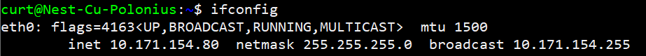
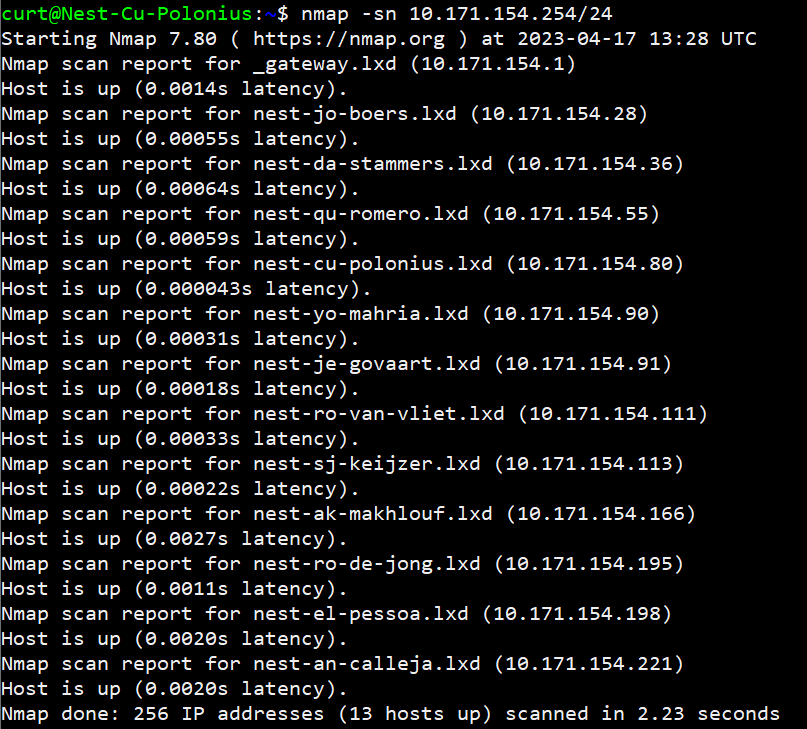
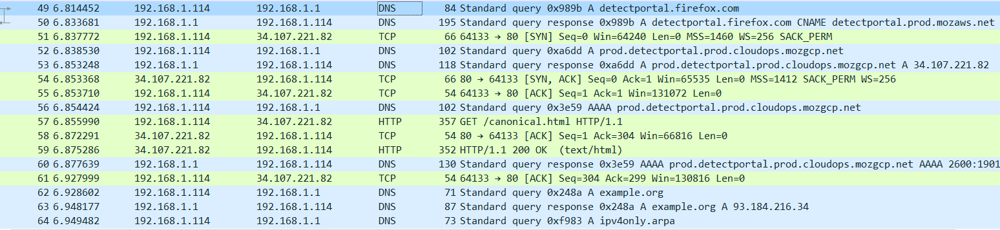

# Network Detection
Network detection in IT refers to the process of identifying and locating devices and services on a computer network. This is typically done for the purposes of network mapping, security auditing, troubleshooting, and performance analysis.

## Key-terms
**Nmap (Network Mapper)**

Is a tool that scans a network to find information about it. For example, what ports are open in a host in your network.

**Wireshark**

Is a protocol analyzer. It looks at network traffic and shows information about packets like protocol and destination (among other things).

## Opdracht
- Scan the network of your Linux machine using nmap. What do you find?

- Open Wireshark in Windows/MacOS Machine. Analyse what happens when you open an internet browser. (Tip: you will find that Zoom is constantly sending packets over the network. You can either turn off Zoom for a minute, or look for the packets sent by the browser between the packets sent by Zoom.)

### Gebruikte bronnen
ChatGPT

https://hackertarget.com/wireshark-tutorial-and-cheat-sheet/

### Ervaren problemen
None

### Resultaat
When it came to the task of scanning the network on my Linux Machine using nmap, I first had to do an installation to be able to use the **ifconfig** command.

After using the ifconfig command it displayed the broadcast address.

I then searched for the command to be able to use nmap to scan the network and I found that it was.

**nmap -sn <ip_range>**

I took one binary bit off the broadcast address to find the last host ip address. I then filled it in the command to do the scan. I then ended up seeing 13 host addresses that were up on the network.

When doing the Wireshark task. I closed zoom to make thinks easier. I then closed my web-browser.

Then I started Wireshark and immediately opened the web-browser. I stopped Wireshark and searched for the first point I saw activity from my browser

The very first one I saw was a DNS protocol, that stated "A detectedprotal.firefox.com"
