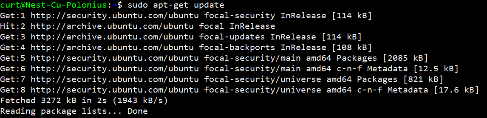
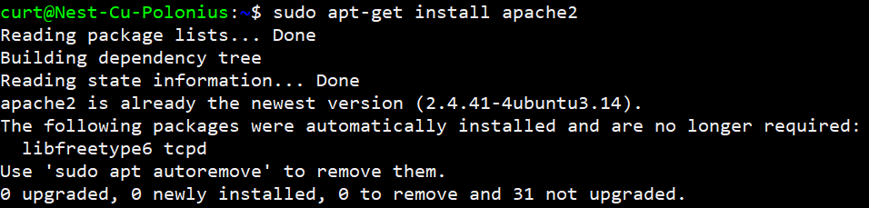
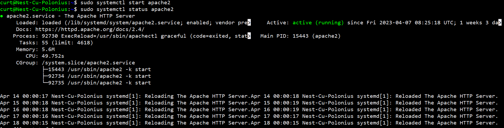
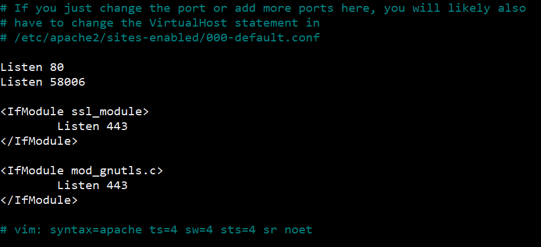
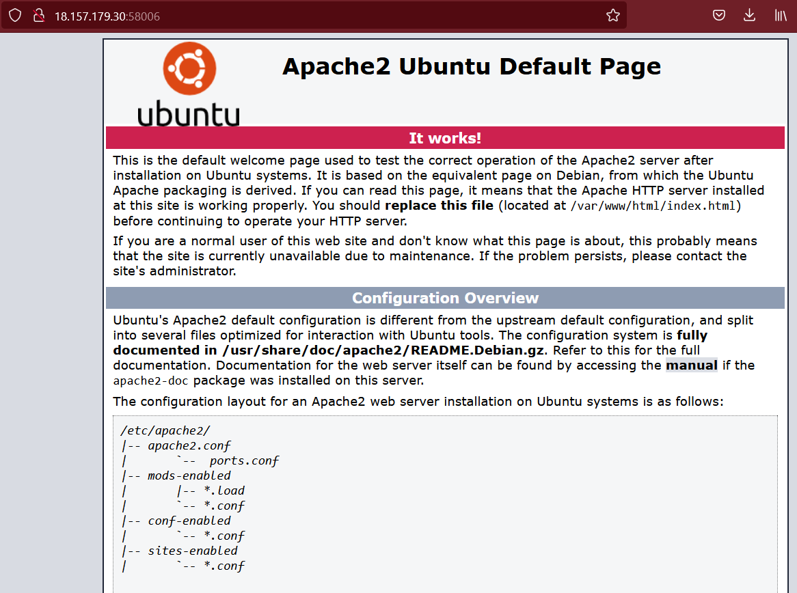
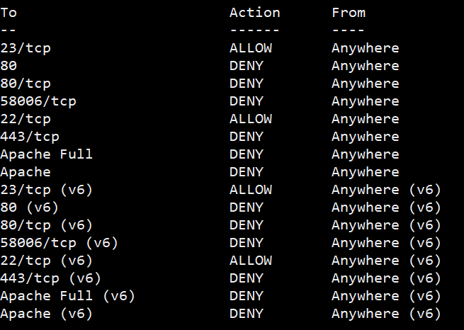
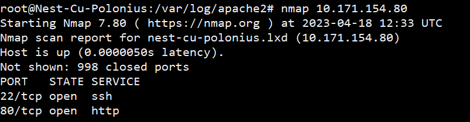
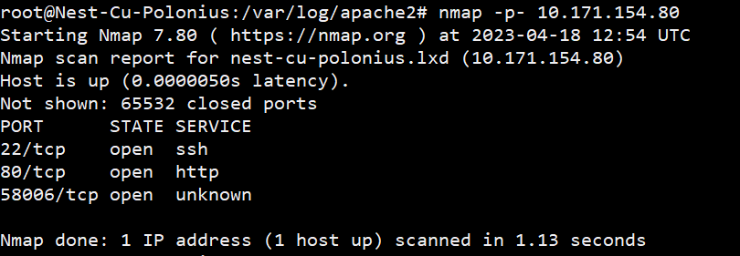
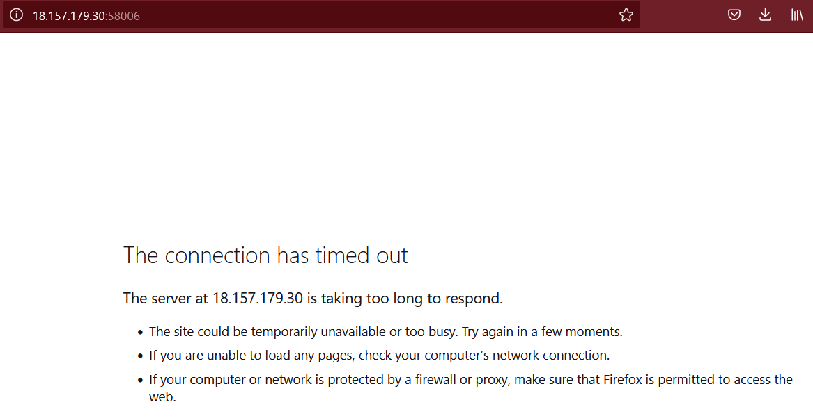

# Firewalls
A firewall is a network security device that is used to monitor and control incoming and outgoing network traffic based on a set of predefined security rules. Firewalls can be hardware devices or software programs that are installed on a computer or server.

## Key-terms
 firewall ufw

 firewall daemon (firewalld)

 iptables

 stateful

 stateless

## Opdracht
- Install a webserver on your VM.
- View the defaults page that comes with your webserver.
- Configure the firewall to block web traffic, but allow ssh traffic.
- Check to see if the firewall is doing it's job

### Gebruikte bronnen
https://www.youtube.com/watch?v=1CDxpAzvLKY

https://www.youtube.com/watch?v=wD3sbvDA0h0

https://www.youtube.com/watch?v=zyWVyuwJ5SU

### Ervaren problemen
I can't access the web-server via my browser. I checked if apache is running, I checked which port it's listening on, updated apache, updated my system, did ping tests to see if my network is working. Nothing seems to work. I only get a message stating.

**The connection has timed out**

**The server at 10.171.154.80 is taking too long to respond.**

AFTER THE Q&A. 

I realized that maybe I am using the wrong IP address based on how the VM is setup. So I went to the IP listed under server_name in the spreadsheet and used **18.157.179.30:58006** and it worked.

### Resultaat
A screenshot of me installing Apache2 web-server after updating the system.

I then started the Apache2 web-server and checked if it was running.

To view the default page, there had to be some adjustments made. As defaults the web-server is listening on port 80. 

But based on the way our VM is setup we had to adjust the port it listens to. in my case this was port: 58006.

This was done with the following command 

**sudo nano /etc/apache2/ports.conf**

After using the correct IP address and my unique port number I was able to access the the web-server default page.

As for the task of blocking web traffic but allowing SSH traffic. I proceeded to do these commands in the exact order.

1. **sudo ufw allow ssh**
2. **sudo ufw deny http**
3. **sudo ufw deny https**

After attempting to block all web ports and even the unique web port. I still have access to them.

I did a scan using nmap and it still shows my ports open.

I then cleared my web-browser cache and I am now unable to access the web-server default page.

I then allowed the ports again and was able to reconnect

