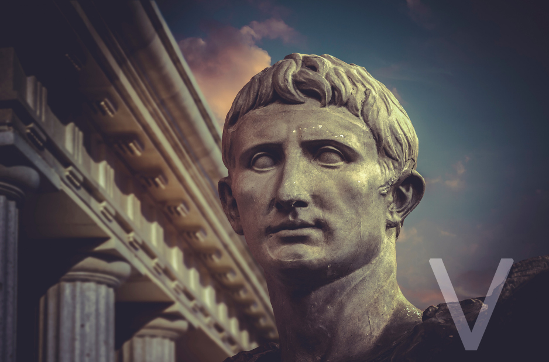

# Symmetric Encryption
Symmetric Encryption is a method of securing information by using a secret key to encrypt and decrypt messages. Both the sender and receiver use the same key to encrypt and decrypt the information. Think of it like a shared secret code that only the sender and receiver know. This way, even if someone intercepts the message, they won't be able to read it without the key.

## Key-terms
**Encryption**

Encryption is the process of converting plain, readable data or information into a coded or unreadable format, also known as ciphertext.

**Data at Rest**

Data at rest refers to any type of digital information or data that is stored or saved on a device or system, such as a hard drive, database, or cloud storage. This data is not actively being used or transmitted and is considered to be "at rest" until it is accessed or modified. 

**Data in Motion**

Data in motion, also known as data in transit, refers to any type of digital information or data that is being transmitted or sent over a network or communication channel, such as the internet, email, instant messaging, or file transfer protocols. This data is actively moving between two or more devices, and is considered to be "in motion" until it reaches its destination.

**Ciphers**

A cipher is a method of transforming plaintext, which is the original message, into ciphertext, which is a scrambled or encoded version of the message, in order to protect its confidentiality or privacy. A cipher uses an algorithm or mathematical formula to perform the encryption process, which can involve substituting letters or numbers, transposing them, or using other techniques to obscure the original message.

**Caesar Cipher**

The Caesar cipher is a type of substitution cipher that was used in ancient Rome to encode messages, named after Julius Caesar who is said to have used it to communicate with his generals. The cipher works by shifting each letter in the plaintext a certain number of places down the alphabet to create the corresponding letter in the ciphertext. For example, if the shift is 3, then the letter A would be replaced with the letter D, B with E, C with F, and so on. The Caesar cipher is a simple and easy-to-use encryption method, but it is also relatively easy to crack, as there are only 25 possible shifts to try. Therefore, it is not considered to be a very secure encryption method by modern standards.

**Cryptography**

Cryptography is the study and practice of securing digital information and communications using mathematical algorithms and techniques. It involves techniques for encryption, decryption, and authentication, as well as methods for ensuring data confidentiality, integrity, and availability.

## Opdracht

- Find one more historic cipher besides the Caesar cipher.

- Find two digital ciphers that are being used today.

- Send a symmetrically encrypted message to one of your peers via the public Slack channel. They should be able to decrypt the message using a key you share with them. Try to think of a way to share this encryption key without revealing it to everyone. You are not allowed to use any private messages or other communication channels besides the public Slack channel. Analyse the shortcomings of symmetric encryption for sending messages.

### Gebruikte bronnen
https://www.theguardian.com/childrens-books-site/2015/sep/10/top-10-codes-keys-and-ciphers

ChatGPT

https://www.arcserve.com/blog/5-common-encryption-algorithms-and-unbreakables-future

### Ervaren problemen
None

### Resultaat
The following are 9 other historical ciphers:

1. Alberti's disk
2. The Vigenère square
3. The Shugborough inscription
4. The Voynich manuscript
5. Hieroglyphs
6. The Enigma machine
7. Kryptos
8. RSA encryption
9. The Pioneer plaques

The following are two digital ciphers used today:

1. Triple DES
2. Blowfish

The sharing of an encrypted message task went as followed.

I used the above image as a pre-cipher. It indicates that you should use the caeser cipher with a shift of 5 to decrypt the following message.

**H nx ktw Hzwy, sty Hfjxfw. Dtz Rfd Htsynszj Bnym Ymj Wjfq Hnumjw**

The following was the actual clue to decrypt my cipher.

The top two images have half a lock symbol each to indicate this is the system I used to lock the message.

The fish is a Pufferfish or also called a Blowfish. This indicated that they should use the Blowfish method.

The image of the N64 has 3 extra letters on it (E, C and B), indicating I used the ECB cipher mode. The 64 on the the N64 indicates that I used BASE 64. 

The bottom two images have half of a key sumbol each to indicate these are the key clues.

The first image has the I AMsterdam sign and the other an image of the colleseum in Rome. 

The key is IamRome

