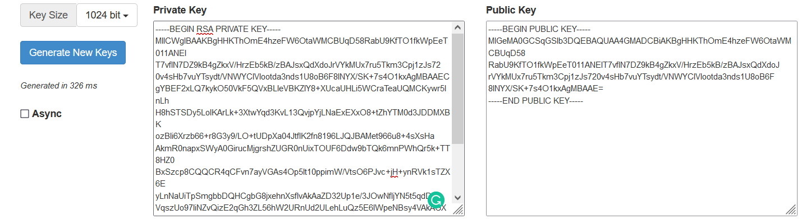
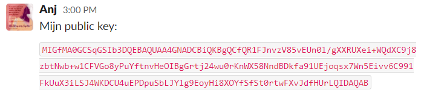
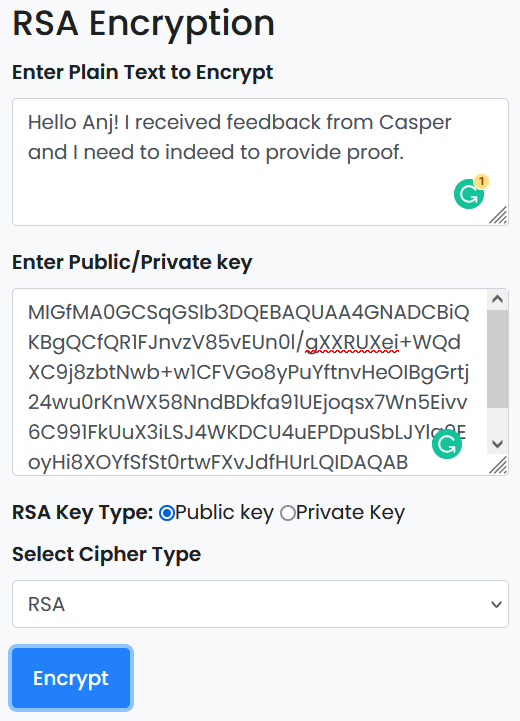
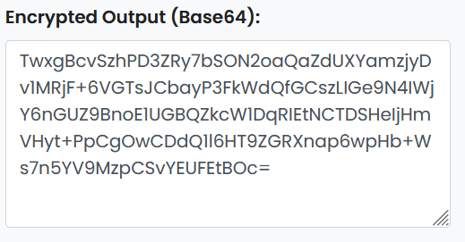
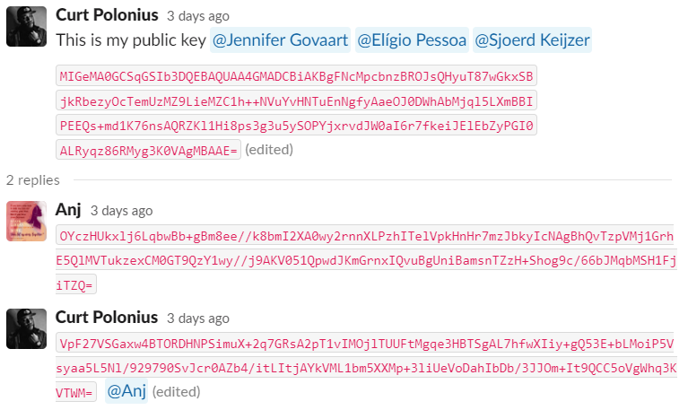

# Asymmetric Encryption
Asymmetric encryption, also known as public key cryptography, is a method of encrypting digital information using a pair of keys - a public key and a private key - that are mathematically related but not identical. The public key is widely available and can be used by anyone to encrypt messages, while the private key is kept secret and is used to decrypt the messages that are encrypted with the public key.

## Key-terms
**Public key**

The public key is used for encryption. It is made freely available to anyone who wants to send an encrypted message to the owner of the key. When someone encrypts a message using the public key, only the private key holder can decrypt and read the message.

**Private key**

The private key is used for decryption. It is kept secret by the owner of the key and is used to decrypt messages that have been encrypted using the corresponding public key. The private key must be kept secret to ensure that only the intended recipient can decrypt and read the message.

## Opdracht
- Generate a key pair.

- Send an asymmetrically encrypted message to one of your peers via the public Slack channel. They should be able to decrypt the message using a key. The recipient should be able to read the message, but it should remain a secret to everyone else. You are not allowed to use any private messages or other communication channels besides the public Slack channel. Analyse the difference between this method and symmetric encryption.

### Gebruikte bronnen
ChatGPT

https://travistidwell.com/jsencrypt/demo/

https://www.devglan.com/online-tools/rsa-encryption-decryption

### Ervaren problemen
None

### Resultaat
I have successfully generated a key pair.

In order to send a fellow student a message, I needed to take the following steps:

1. Make a copy of their **public key**.

2. Go to a site or use a program that is able to encrypt and decrypt messages. Write her a message and paste her public key into the public key section of the encrypt message sector.

3. Click the encrypt button and copy the resulted encrypted message.

4. After sending the encrypted message to my classmate she would be the only one able to decrypt the message using her **private key**

Comparing Asymmetrical and Symmetrical methods of encryption shows the following factors:

- When it comes to symmetrical encryption, anyone that figures out your encryption method or methods will be able to decrypt your messages.

- When it comes to asymmetrical, even if they find out your encryption method wether it be RSA, ECC, ElGamal etc. They would not be able to decrypt the message without the private key.

The flaw of the symmetrical system is that you can use the encrypted message to find out the method used and decrypt it.

At the other hand when it comes to the asymmetrical system, a key factor is that there is no possible way to use the public key or the encrypted message, to derive what the private key is.
