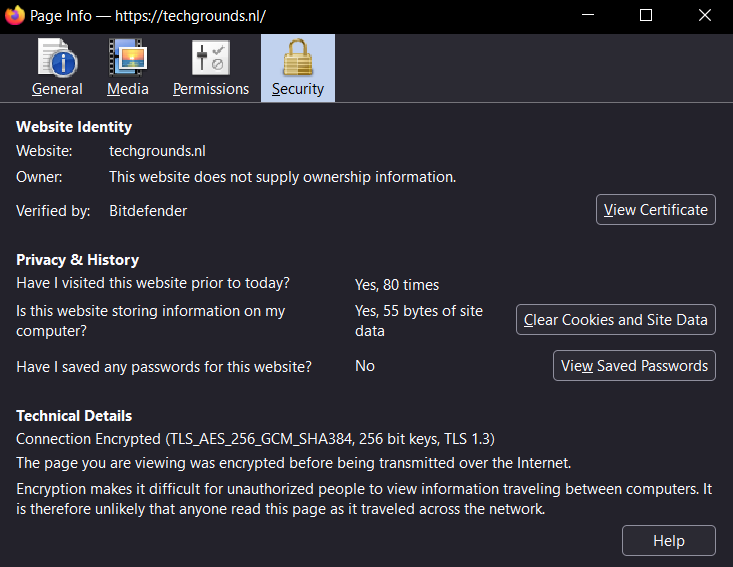
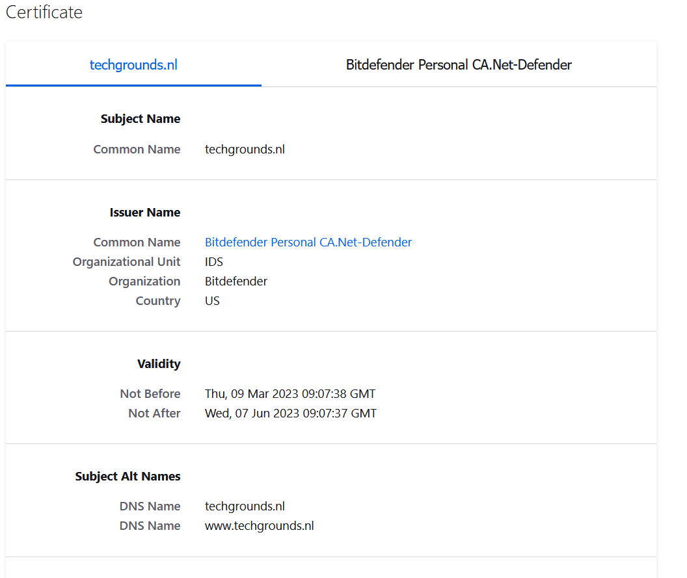
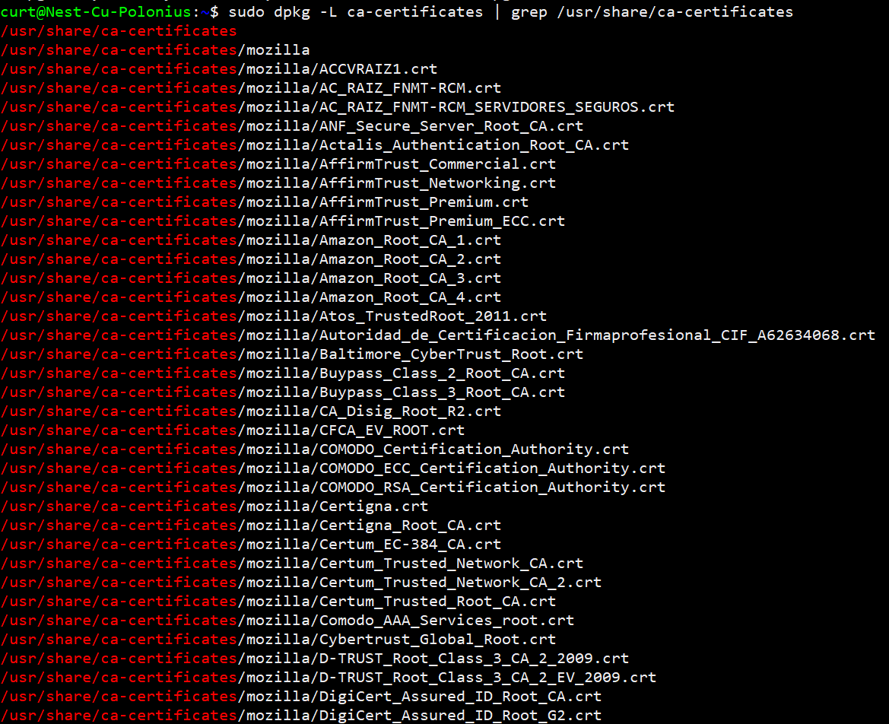

# Public Key Infrastructure
Public Key Infrastructure (PKI) is a system that uses encryption and digital certificates to provide secure communication over the internet.

In simple terms, PKI is like a digital ID card that verifies the identity of individuals or organizations online. This digital ID card consists of a public key and a private key. The public key can be freely shared and is used to encrypt messages, while the private key is kept secret and used to decrypt them.

## Key-terms
**X.509**

X.509 is a standard for digital certificates used in Public Key Infrastructure (PKI) systems.

In simple terms, X.509 is a format for storing and transmitting digital certificates that verify the identity of individuals, organizations, or devices.

X.509 certificates contain information about the certificate holder, such as their name, public key, and the certificate's expiration date. They are used to authenticate and encrypt communication over the internet and other networks.

## Opdracht
- Create a self-signed certificate on your VM.
- Analyze some certification paths of known websites (ex. techgrounds.nl / google.com / ing.nl).
- Find the list of trusted certificate roots on your system (bonus points if you also find it in your VM).

### Gebruikte bronnen
ChatGPT

https://www.digitalocean.com/community/tutorials/how-to-create-a-self-signed-ssl-certificate-for-nginx-in-ubuntu-22-04

### Ervaren problemen
[Geef een korte beschrijving van de problemen waar je tegenaan bent gelopen met je gevonden oplossing.]

### Resultaat
I took the following steps to create my self-signed certificate on my VM.

1. To make sure openssl was installed on my VM I did the installation command

    **sudo apt-get install openssl**

2. Created a private key using the command. This will generate a private key in the key.pem file 

    **openssl genpkey -algorithm RSA -out key.pem**

3. Created a Certificate Signing Request (CSR) using the following command. This will generate a CSR in the csr.pem file.

    **openssl req -new -key key.pem -out csr.pem**

4. Create a self-signed certificate using the following command. This will generate a self-signed certificate in the cert.pem file that is valid for 365 days.

    **openssl x509 -req -days 365 -in csr.pem -signkey key.pem -out cert.pem**

5. Filled out the certificate. I also used the following command to verify the content of the certificate.

    **openssl x509 -in cert.pem -text**

## Analyzing Techgrounds.nl Certification Path
This information can easily be found by clicking on the lock symbol next to the website URL on your web-browser.

**Find the list of trusted certificate roots on your system For Windows:**

   1. Open the Microsoft Management Console (MMC) by pressing the Windows key + R, typing "mmc" in the Run dialog box, and pressing Enter.

   2. In the MMC console window, click on "File" in the menu bar and select "Add/Remove Snap-in".

   3. In the "Add or Remove Snap-ins" window, select "Certificates" from the list of available snap-ins and click on "Add".

   4. In the "Certificates Snap-in" window, select "Computer account" and click on "Next".

   5. In the "Select Computer" window, select "Local computer" and click on "Finish".

   6. In the "Add or Remove Snap-ins" window, click on "OK" to close the window and return to the MMC console window.

   7. In the MMC console window, expand the "Certificates (Local Computer)" folder and navigate to the "Trusted Root Certification Authorities" folder.

   8. Click on the "Certificates" folder to view the list of trusted root certificates on your system.

**Find the list of trusted certificate roots on your system For Linux VM:**

1. Run the following command to locate the directory where your system's trusted root certificates are stored:

    **sudo find / -name "ca-certificates.crt" 2>/dev/null**

2. Run the following command to display the contents of the "ca-certificates.crt" file

    **sudo nano /path/to/ca-certificates.crt**

    Replace "/path/to/" with the path to the "ca-certificates.crt"

    

    This shows the content in encrypted form.

To display the certification contents in readable form, use the following command:.

**sudo dpkg -L ca-certificates | grep /usr/share/ca-certificates**

