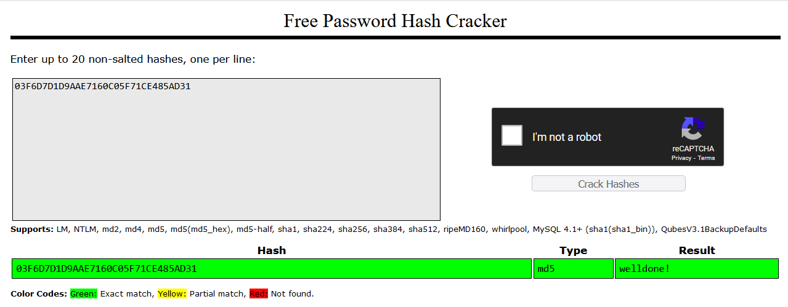
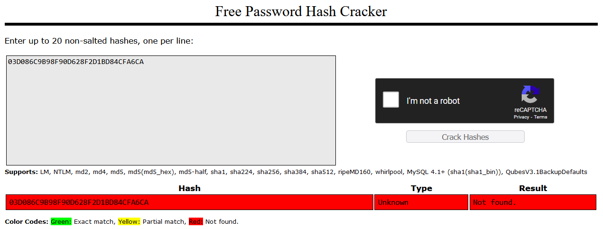
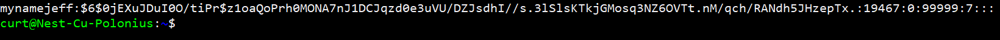
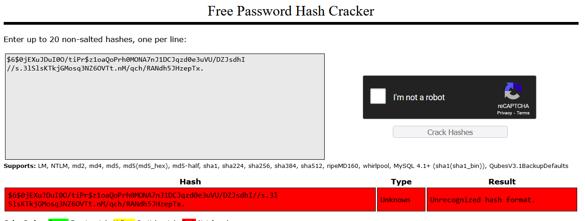

# Passwords
A password is a string of characters used to authenticate and authorize access to a computer system, network, or other digital resource. It is intended to be known only by the user who creates it, and serves as a security measure to prevent unauthorized access to sensitive data or resources.

## Key-terms
**Hasing**

Hashing is a process of taking some information, like a password or a piece of data, and turning it into a unique string of letters and numbers. This string is called a "hash" and is used to verify that the original information hasn't been tampered with. It's like creating a fingerprint for the data that can't be reversed to recreate the original information.

**Rainbow Table**

A rainbow table is a pre-computed table of possible password hashes. Hackers can use a rainbow table to compare the hash of a stolen password with the hashes in the table to find a match. Rainbow tables can be effective for cracking simple passwords or commonly used hashing algorithms, but they are less effective against complex passwords or more secure hashing methods. To protect against rainbow table attacks, it's important to use strong, unique passwords and strong hashing algorithms.

**MD5**

MD5 is a cryptographic hash function that can be used to create a one-way hash of a password or any other data. MD5 is no longer considered secure for password hashing because it can be easily cracked using brute force or dictionary attacks.

**Hash Salt**

A hash salt is a random string of characters that is added to a password before it is hashed. The salt is unique for each user account and is usually generated by a computer system. The purpose of adding a salt to a password is to increase the security of the hash by making it more difficult to use precomputed hash tables, such as rainbow tables, to crack the password.

## Opdracht
- Find out what hashing is and why it is preferred over symmetric encryption for storing passwords.

- Find out how a Rainbow Table can be used to crack hashed passwords.

- Below are two MD5 password hashes. One is a weak password, the other is a string of 16 randomly generated characters. Try to look up both hashes in a Rainbow Table.
03F6D7D1D9AAE7160C05F71CE485AD31
03D086C9B98F90D628F2D1BD84CFA6CA

- Create a new user in Linux with the password 12345. Look up the hash in a Rainbow Table.

- Despite the bad password, and the fact that Linux uses common hashing algorithms, you won’t get a match in the Rainbow Table. This is because the password is salted. To understand how salting works, find a peer who has the same password in /etc/shadow, and compare hashes.

### Gebruikte bronnen
https://crackstation.net/

https://www.youtube.com/watch?v=aC7Pjjr6NcM&t=249s

### Ervaren problemen
I spent too much time searching if I had the correct hash selected because it was not working in the hash cracker. If I had only continued to read the next task I would have seen that IT WAS SUPPOSED TO NOT WORK.

Lessoned learned.

### Resultaat
**The reason why hashing is preffered over symmetric ecnryption is the following:**

Hashing is preferred over symmetric encryption for storing passwords because of the one-way nature of hashing. When a password is hashed, it is transformed into a fixed-length string of characters that cannot be easily reversed to obtain the original password. This means that even if an attacker gains access to the password hash, they cannot easily retrieve the password itself.

In contrast, symmetric encryption can be reversed if the key used to encrypt the data is known. This means that if an attacker gains access to the encrypted password and the encryption key, they can easily decrypt the password and obtain the original plaintext password.

**How can a rainbow table be used to crack a hashed password?**

Here's how it works:

   1. A hacker steals a hashed password from a website or database.

   2. They look up the hash in their pre-computed rainbow table.

   3. If a match is found, the corresponding password is revealed.

   4. If a match isn't found, the hacker may try a different attack method or generate a new rainbow table.

**Below you will see the decrypted hash password and the result of the random generated characters**

**Below you will see the newly created user and the corresponding hash password**

**Below you will see proof that thanks to the hash salt, the hash could not be decrypted**

Comparing the hash to a peer it indeed shows two different hashes, despite using the same password.

