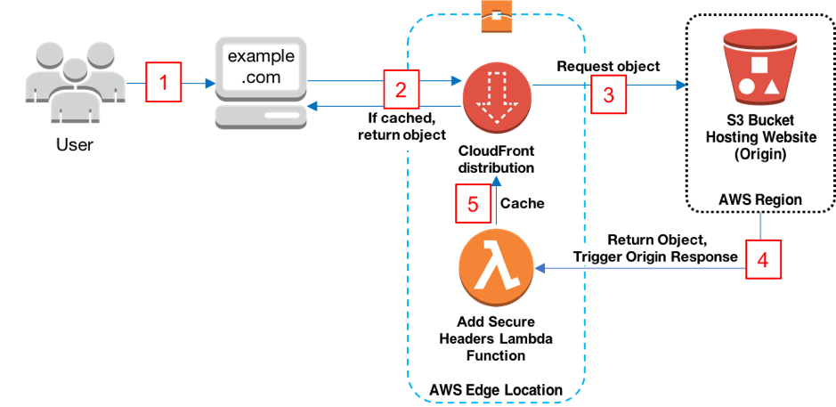

# AWS Global Infrastructure
AWS Global Infrastructure refers to the worldwide network of physical data centers, Edge Locations, and network connectivity that AWS uses to provide cloud computing services to its customers.

## Key-terms
**IAM**

AWS IAM (Identity and Access Management) is a service that enables you to manage users, groups, and permissions for accessing AWS resources in a secure and controlled manner. IAM allows you to create and manage user accounts, assign permissions to these accounts, and grant access to specific AWS services and resources.

**Instances**

On AWS, an instance is a virtual server that you can launch in the cloud to run your applications or host your website. An instance is similar to a physical server, but it runs on AWS infrastructure and is managed by AWS. You can choose from a variety of instance types with different combinations of CPU, memory, storage, and network capacity to meet your application's specific needs. 

**RDS Instances**

RDS (Relational Database Service) instances are managed database servers provided by AWS that enable you to run a variety of popular relational database engines, such as MySQL, PostgreSQL, Oracle, and Microsoft SQL Server, in a scalable, secure, and cost-effective manner.

## Opdracht
- Study what is an AWS Availability Zone?
- Study what is a Region?
- Study what is an Edge Location?
- Study why would you choose one region over another? (e.g. eu-central-1 (Frankfurt) over us-west-2 (Oregon)).

### Gebruikte bronnen
ChatGPT

Udemy Course: Introduction to Cloud Computing on AWS for Beginners 2023

Udemy Course: Ultimate AWS Certified Cloud Practitioner - 2023

### Ervaren problemen
None

### Resultaat
**AWS Availabilty Zone**

An AWS Availability Zone is a separate physical location with its own power, cooling, and network infrastructure, designed to be isolated from failures in other Availability Zones, so that if one zone goes down, services can automatically failover to another zone without disruption.

**Region**

An AWS Region is a geographic area where AWS has multiple data centers, each with its own Availability Zones, to provide customers with a highly available and fault-tolerant infrastructure. Each region is completely independent and isolated from other regions, so that customers can choose to store their data and run their applications in the region that is closest to their users or meets their specific needs.

**Edge Location**

An Edge Location is a physical location where AWS has a presence, typically consisting of a small data center or a cache server, that serves as a distribution point for AWS services to be delivered to end users. Edge Locations are strategically located around the world to improve the performance and availability of services, and to reduce latency by caching frequently accessed content closer to the end users.

**Reason to pick one region over another**

It comes down to different factors.

- The closer the region is to the end user the better for latency and performance.

- The costs, seeing pricing can vary per region.

- The availabilty of services, seeing that not all regions have every services available to them.

