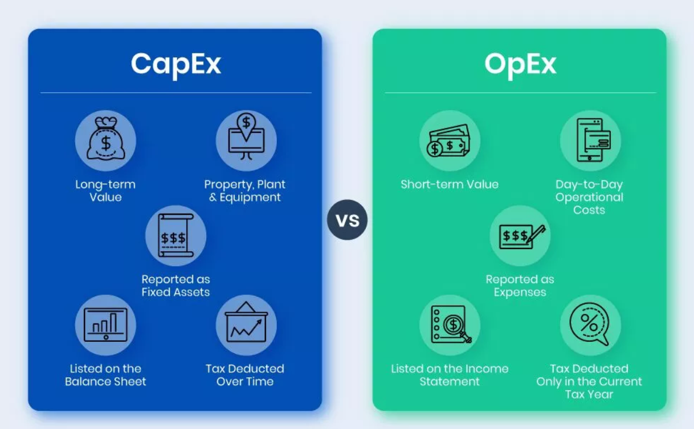
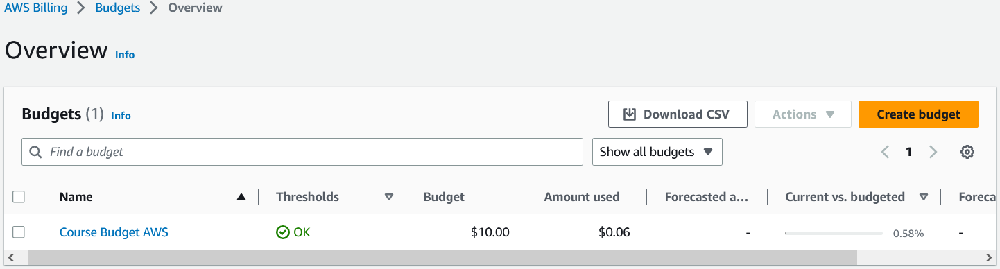
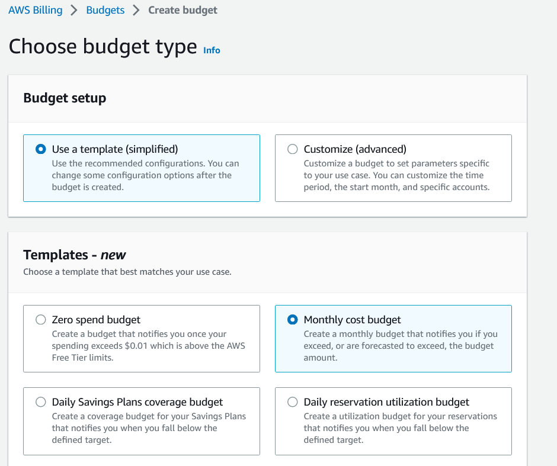
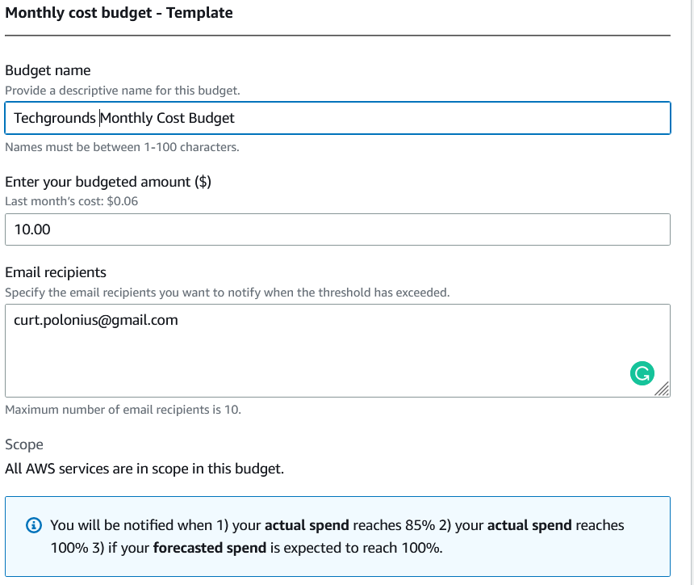

# AWS Pricing
AWS pricing is based on the resources you use, such as compute power, storage, and data transfer. You only pay for what you use and there are no upfront costs or long-term commitments.

## Key-terms

**Total Cost of Ownership (TCO)**

Total Cost of Ownership (TCO) is a financial estimate of all the costs associated with owning and using a product or service over its entire lifecycle. This includes not only the initial purchase price, but also ongoing costs such as maintenance, upgrades, and support. By considering the full cost of ownership, businesses can make better decisions about which products or services will provide the most value over time, and can make more accurate budgeting and forecasting decisions.

AWS Total Cost of Ownership (TCO) is a methodology for estimating the overall cost of running a workload on AWS compared to running the same workload on-premises or with another cloud provider.

**capital expenditures (capex)**

Capital Expenditures (CapEx) are expenses that a company incurs in order to acquire, improve, or maintain long-term assets such as property, buildings, or equipment. These are investments that will provide benefits to the company for multiple years, rather than being consumed in the current period. Examples of CapEx might include the purchase of a new factory, the installation of new equipment, or the construction of a new building. CapEx is generally treated differently than other expenses in accounting, and is often subject to different tax treatment.

**operational expenditures (opex)**

Operational Expenditures (OpEx) are expenses that a company incurs in order to operate its business on a day-to-day basis. These are the ongoing costs of running a business, such as rent, utilities, salaries, and marketing expenses. Unlike CapEx, which is typically a one-time investment in a long-term asset, OpEx is an ongoing expense that is necessary to keep the business running. OpEx is generally fully deductible in the current period for tax purposes, unlike CapEx which may be subject to depreciation or other tax treatment.

**S3**

Amazon S3 (Simple Storage Service) is an object storage service that provides a scalable and secure way to store and retrieve data from the cloud. It can be used to store and retrieve any amount of data, at any time, from anywhere on the web.

**EC2**

Amazon EC2 (Elastic Compute Cloud) is a web service that provides resizable compute capacity in the cloud. It allows customers to quickly deploy and run applications on a scalable and reliable infrastructure.

## Opdracht
- Study the four advantages of the AWS pricing model.

- Study AWS free tier for: S3, EC2 and Always free services.

- Study the differences between capex and opex.

- Create an alert that you can use to monitor your own cloud costs.

- Understand the options that AWS offers to get insights in your cloud costs.

### Gebruikte bronnen
ChatGPT

https://calculator.aws/#/

https://docs.aws.amazon.com/pdfs/whitepapers/latest/how-aws-pricing-works/how-aws-pricing-works.pdf

### Ervaren problemen
None

### Resultaat
**The Four Advantages of AWS Pricing Model**

1. **Pay-as-you-go:** AWS Pay-as-you-go means that you only pay for the services and resources you use, without any upfront costs or long-term commitments. You can scale up or down your usage as needed, and you only pay for what you use. This pricing model is flexible and allows you to optimize your costs based on your business needs.

2. **Save when you commit:** AWS Save When You Commit is a pricing model that rewards you for making a commitment to use a specific amount of resources for a certain period of time, typically one or three years. By committing to use AWS services for a longer period, you can get a discounted rate compared to the pay-as-you-go pricing. This model can help you save money if you have predictable workloads and can commit to a certain usage level for a specified period of time.

3. **Pay less by using more:** AWS Pay Less by Using More is a pricing model where the cost per unit of usage decreases as you consume more resources. This means that the more you use, the less you pay per unit. This pricing model encourages customers to use AWS services at a larger scale, which can help reduce overall costs. It can be particularly beneficial for workloads with high resource utilization or that require consistent, high levels of usage.

4. **Benefit from massive economies of scale:** AWS Benefit from Massive Economies of Scale means that AWS can offer its services at a lower cost due to its ability to operate on a larger scale. AWS has built a massive infrastructure that spans the globe, allowing it to efficiently deliver computing resources to customers at a lower cost than would be possible for smaller organizations. This pricing model benefits customers by providing them with access to cost-effective computing resources, while also allowing AWS to continue to invest in its infrastructure to support continued growth and innovation.

**AWS Free Tier Study**

AWS Free Tier allows customers to explore and test AWS services at no cost.

- **S3 Free Tier:** With this tier, you can store up to 5GB of data in Amazon S3, and access it through the internet, for free. You can also transfer up to 1GB of data out of Amazon S3 each month at no cost.

- **EC2 Free Tier:** This tier provides customers with up to 750 hours per month of a single Amazon EC2 instance running Linux or Windows, and 750 hours per month of an Amazon Elastic Load Balancer, for free. Additionally, you get up to 30GB of Amazon Elastic Block Storage (EBS) for free.

- **Always Free Services:** These are a set of AWS services that are always free, with some usage limits. They include services such as AWS Lambda, Amazon DynamoDB, Amazon SNS, and others.

**CapEx vs OpEx**

A CapEx vs OpEx comparrison

When using AWS, CapEx refers to the upfront costs associated with purchasing and deploying infrastructure such as servers, storage, and networking equipment. 

OpEx refers to the ongoing costs of using AWS services, such as compute power, storage, and data transfer. These costs are typically charged on a pay-as-you-go basis, so customers only pay for the services they use.

By using AWS, companies can shift from a CapEx model to an OpEx model, which can help reduce upfront costs and provide greater flexibility in terms of scaling resources up or down as needed.

**Create an alert that you can use to monitor your own cloud costs**

For this I had to take the following steps:

1. Go to the AWS Budgets console at https://console.aws.amazon.com/billing/home#/budgets.

2. Click "Create budget."

3. Choose a budget type. You can choose "Cost budget" to track your costs, or "Usage budget" to track your usage.

4. Enter a budget name and choose the appropriate budget period.

5. Choose your budgeted amount. You can enter an absolute value, or use a percentage of your previous month's costs or usage.

6. Choose your budgeted time period. You can set your budget to recur monthly, quarterly, or annually.

7. Choose your notification options. You can choose to receive email notifications when you exceed a certain threshold, or when your spending or usage is trending in a certain direction.

8. Set up your alert threshold. You can set a specific dollar amount or percentage over or under your budget, and choose whether to receive an alert when you exceed or fall below that amount.

9. Review and confirm your budget settings, and then click "Create budget."

**Understand the options that AWS offers to get insights in your cloud costs**

AWS offers several options to get insights into your cloud costs. Here are some of the key ones:

1. AWS Cost Explorer: This is a tool that allows you to view and analyze your AWS usage and costs over time. You can use it to see how much you're spending on different services, identify cost trends, and create custom reports.

2. AWS Budgets: This is a service that allows you to set custom cost and usage budgets for your AWS accounts. You can use it to track your spending against your financial targets, and receive alerts when you exceed your budget.

3. AWS Trusted Advisor: This is a service that provides recommendations to help optimize your AWS usage and costs. It offers insights in areas such as cost optimization, security, and performance.

4. AWS Cost and Usage Reports: This is a service that provides detailed reports on your AWS usage and costs. You can use it to track your spending by service, region, or tag, and download the data for further analysis.

5. AWS Cost Anomaly Detection: This is a service that uses machine learning to identify anomalous spending patterns in your AWS accounts. You can use it to detect unexpected changes in your usage and costs, and take corrective action if necessary.

Overall, these tools can help you gain greater visibility into your AWS usage and costs, identify areas where you can optimize your spending, and make informed decisions about your cloud infrastructure.

