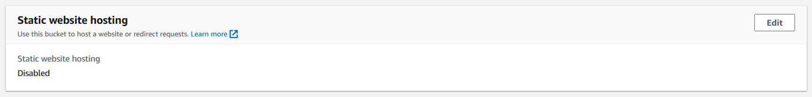

# Simple Storage Service (S3)
AWS S3 (Simple Storage Service) is a cloud-based storage service provided by Amazon Web Services (AWS) that allows you to store and retrieve data and files on the internet. It provides highly scalable, durable, and secure storage that can be accessed from anywhere in the world through a simple web interface or API.

## Key-terms
**S3 Standard**

S3 Standard is a storage class offered by Amazon Web Services (AWS) for their Simple Storage Service (S3), which provides highly durable and scalable object storage for various types of data. S3 Standard is designed for frequently accessed data and offers low latency and high throughput performance, making it suitable for a wide range of applications, such as data analytics, media content, and backup and recovery.

**S3 Standard-IA**

S3 Standard-IA is a storage class offered by Amazon Web Services (AWS) for their Simple Storage Service (S3), which provides highly durable and scalable object storage for various types of data. S3 Standard-IA is designed for infrequently accessed data and offers lower storage costs compared to S3 Standard, making it suitable for long-term storage and backup of data that is not accessed frequently. However, retrieving data from S3 Standard-IA may incur additional retrieval fees and longer retrieval times compared to S3 Standard.

**S3 One-zone IA**

S3 One-zone IA is a storage class offered by Amazon Web Services (AWS) for their Simple Storage Service (S3), which provides highly durable and scalable object storage for various types of data. S3 One-zone IA is designed for infrequently accessed data that can be recreated if lost and offers lower storage costs compared to other S3 storage classes. However, unlike other storage classes, S3 One-zone IA stores data in a single availability zone, which means that data may be lost permanently in the event of an outage in that zone. S3 One-zone IA is suitable for storing data that can be easily recreated or is not critical.

**S3 Glacier**

S3 Glacier is a storage class offered by Amazon Web Services (AWS) for their Simple Storage Service (S3), which provides highly durable and secure object storage for long-term data archiving and backup. S3 Glacier is designed for data that is rarely accessed and offers low storage costs, but retrieval of data from S3 Glacier can take several hours to complete and may incur additional retrieval fees. S3 Glacier also offers features such as data encryption and lifecycle policies to automate data transfers and deletion.

**S3 Glacier Instant Retrieval**

S3 Glacier Instant Retrieval is a feature offered by Amazon Web Services (AWS) for their S3 Glacier storage class, which provides fast access to data stored in S3 Glacier. This feature allows users to retrieve data within one to five minutes, compared to the several hours it can take to retrieve data using the standard retrieval option. However, S3 Glacier Instant Retrieval incurs higher retrieval costs compared to the standard option and is designed for data that requires more frequent access.

**S3 Glacier Flexible Retrieval**

S3 Glacier Flexible Retrieval is a feature offered by Amazon Web Services (AWS) for their S3 Glacier storage class, which provides a more cost-effective retrieval option for data stored in S3 Glacier. This feature allows users to retrieve data within hours, rather than minutes or days, at a lower cost compared to the standard or instant retrieval options. However, S3 Glacier Flexible Retrieval is designed for data that can tolerate longer retrieval times and is not suitable for data that requires immediate access.

**S3 Glacier Deep Archive**

S3 Glacier Deep Archive is a storage class offered by Amazon Web Services (AWS) for their Simple Storage Service (S3), which provides the lowest storage costs for long-term data retention and archiving. S3 Glacier Deep Archive is designed for data that is rarely accessed and can tolerate longer retrieval times, as data retrieval can take up to 12 hours. However, S3 Glacier Deep Archive provides the lowest storage costs compared to other S3 storage classes and is suitable for data that is required to be stored for a long time and accessed infrequently.

**Intelligent Tiering**

AWS Intelligent Tiering is a storage class offered by Amazon Web Services (AWS) for their Simple Storage Service (S3), which provides automatic and cost-effective data management by moving data between different S3 storage classes based on access patterns. AWS Intelligent Tiering is designed to optimize storage costs and performance by automatically moving data to the most cost-effective storage class based on the frequency of access. This allows users to access frequently used data quickly, while reducing storage costs for infrequently accessed data.

## Opdracht
**Exercise 1**

- Create new S3 bucket with the following requirements:
Region: Frankfurt (eu-central-1)
- Upload a cat picture to your bucket.
- Share the object URL of your cat picture with a peer. Make sure they are able to see the picture.

**Exercise 2**

- Create new bucket with the following requirements:
Region: Frankfurt (eu-central-1)
- Upload the four files that make up AWS’ demo website.
- Enable static website hosting.
- Share the bucket website endpoint with a peer. Make sure they are able to see the website.

### Gebruikte bronnen
ChatGPT

### Ervaren problemen
Just had to get used to changing permission to Public for the objects and bucket.

### Resultaat
**Exercise 1**

Created S3 Bucket

Upload cat image

In order to share the cat image I had to take the following steps:

1. I had to click on my bucket name, select the permissions option and edit the "Block public access" settings.

2. In the "Block public access" settings I unchecked "Block all public access".

3. Then I had to go to the object in this case the cat picture and click on it's name. I then had to select permissions and click on "becket owner enforced".

4. I then have to enable ACLs.

5. After enabling ACL, I can click the checkbox infront of the object I want to make public, click the "Actions" drop down menu and select "Make public using ACL"

I then successfully shared my cat picture by clicking in the checkbox infront of it and then clicking "Copy URL".

**Exercise 2**

Create new bucket

Upload Demo Website Files

To enable static website hosting I had to take the following steps:

1. After taking the steps to make everything **public**, I click on the bucket name and then "Properties". I scroll all the way to the bottom to find "Static website hosting" and choose "Edit"

2. I then enable "static website hosting", select "host a static website" and then add the index.html and error.html

3. Now if I go to bucket name, properties and scroll down to "Static website hosting", I will see the option to copy the "Bucket website endpoint" URL.

I then posted the URL to my peers and it worked.

