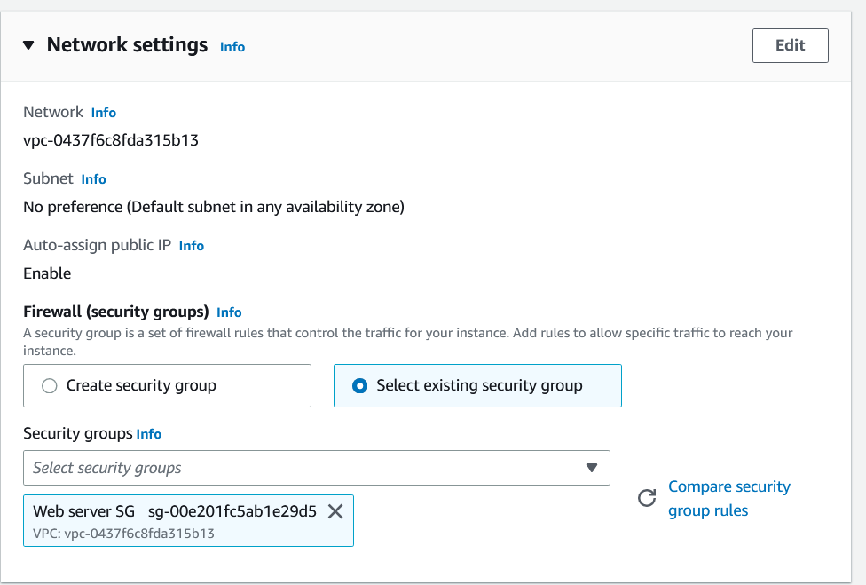

# Elastic Compute Cloud (EC2)
EC2 (Elastic Compute Cloud) is a cloud computing service provided by Amazon Web Services (AWS) that allows you to rent virtual computers (called instances) on which you can run your own applications. Think of it like renting a computer in the cloud instead of buying one yourself. You can choose the size and configuration of the instance you need, and pay for it by the hour or by the second. EC2 instances can be used for a variety of purposes, such as hosting websites, running applications, or processing data.

## Key-terms
**Amazon Machine Image (AMI)**

An Amazon Machine Image (AMI) is a pre-configured virtual machine image that contains everything you need to start up an instance (a virtual computer) on Amazon Web Services' (AWS) Elastic Compute Cloud (EC2) service. Think of it like a snapshot of a computer's operating system, application server, and other software components that are needed to run an application or service. AMIs can be customized, saved, and shared with others, making it easy to replicate and deploy environments. When you launch an EC2 instance from an AMI, you get a copy of the AMI running as a virtual machine in the cloud. This allows you to quickly and easily deploy new instances with a consistent configuration.

**Elastic Block Store (EBS)**

Elastic Block Store (EBS) is a block storage service provided by Amazon Web Services (AWS) that allows you to store data persistently on virtual hard disk drives in the cloud. Think of it like a virtual hard drive that you can attach to an EC2 instance, and use it to store data that needs to persist even after the instance is shut down. EBS volumes are highly available and durable, which means they are designed to be reliable and resilient against hardware failures. You can create, attach, and detach EBS volumes to EC2 instances, and you can also take snapshots of EBS volumes to back up your data. EBS volumes can be used for a variety of purposes, such as storing databases, logs, or application data.

**Instance Store**

Instance Store is a type of storage available on certain types of Amazon Web Services (AWS) Elastic Compute Cloud (EC2) instances that provides temporary block-level storage for your data. Think of it like a local hard drive that is physically attached to the EC2 instance, and is designed to provide high-performance, low-latency storage for your applications. Unlike Elastic Block Store (EBS), the data stored on an instance store volume is not persisted after the instance is stopped or terminated. Instance store volumes are ideal for use cases that require high-performance storage, such as cache storage or temporary data processing. However, it's important to note that the data on an instance store volume can be lost if the instance fails or is stopped, so it's recommended to take regular backups if you're using instance store for critical data.

**Security Group**

A Security Group is a virtual firewall that controls the inbound and outbound traffic for Amazon Web Services (AWS) Elastic Compute Cloud (EC2) instances. Think of it like a set of rules that define what traffic is allowed to reach your instance and what traffic should be blocked. Each security group has a set of inbound and outbound rules that you can configure to allow or deny traffic based on IP address, port number, and protocol. For example, you can create a security group rule to allow incoming traffic on port 80 (HTTP) and block all other ports. Security groups are stateful, which means that if you allow incoming traffic on a port, the outbound traffic for that connection will be automatically allowed. You can associate multiple security groups with an EC2 instance, and you can also modify the rules for a security group at any time. Security groups are an important part of AWS security, as they help you control the network traffic to and from your instances.

**On Demand Instances**

On-Demand Instances are a type of Amazon Web Services (AWS) Elastic Compute Cloud (EC2) instance that allows you to pay for computing capacity by the hour or by the second, without any upfront costs or long-term commitments. Think of it like a pay-as-you-go model for computing resources in the cloud. With On-Demand Instances, you can launch instances whenever you need them, and pay only for the hours you use them. On-Demand Instances are ideal for applications that have short-term, spiky, or unpredictable workloads, or for testing and development environments where you need to quickly spin up and down instances. You can choose from a wide range of instance types and sizes, and you can also stop or terminate instances at any time. On-Demand Instances provide flexibility and scalability, allowing you to quickly adjust your computing capacity to match your needs.

**Reserved Instances**

Reserved Instances are a type of Amazon Web Services (AWS) Elastic Compute Cloud (EC2) instance that allows you to make a one-time upfront payment for a significant discount on the hourly usage rate. Think of it like a reservation for computing capacity in the cloud, where you commit to using a specific instance type for a certain period of time, and in return, you get a lower hourly usage rate. Reserved Instances are ideal for applications that have steady-state or predictable workloads, where you can accurately forecast your computing needs over a longer period of time. With Reserved Instances, you can choose from different payment options (all upfront, partial upfront, or no upfront) and contract lengths (1 year or 3 years) to optimize your savings. You can also modify, exchange, or sell your Reserved Instances at any time. Reserved Instances provide cost savings and predictability, allowing you to reduce your computing costs and improve your budgeting and planning.

**Spot Instances**

Spot Instances are a type of Amazon Web Services (AWS) Elastic Compute Cloud (EC2) instance that allows you to bid on unused computing capacity in the cloud, and run your applications at a significantly lower cost compared to On-Demand Instances. Think of it like a marketplace for computing resources, where you can request instances at a bid price that you're willing to pay, and if the current spot price for that instance type is lower than your bid price, your instances will launch and run until the spot price exceeds your bid price. Spot Instances are ideal for applications that have flexible start and end times, and can tolerate interruptions or stoppages, such as batch processing, data analysis, or testing. With Spot Instances, you can save up to 90% on your EC2 costs, and you can choose from different instance types and sizes to optimize your performance and cost trade-offs. However, it's important to note that your Spot Instances can be terminated with a 2-minute notice if the spot price rises above your bid price, or if AWS needs the capacity back. Spot Instances provide cost savings and flexibility, allowing you to access computing resources that might have been too expensive otherwise, and enabling you to run larger workloads at a lower cost.

## Opdracht
**Exercise 1**

- Navigate to the EC2 menu.
- Launch an EC2 instance with the following requirements:
1. AMI: Amazon Linux 2 AMI (HVM), SSD Volume Type
2. Instance type: t2.micro
3. Default network, no preference for subnet
4. Termination protection: enabled
5. User data:

6. Root volume: general purpose SSD, Size: 8 GiB
7. New Security Group:
Name: Web server SG
Rules: Allow SSH, HTTP and HTTPS from anywhere

**Exercise 2**

- Wait for the Status Checks to get out of the initialization stage. When you click the Status Checks tab, you should see that the System reachability and the Instance reachability checks have passed.
- Log in to your EC2 instance using an ssh connection.
- Terminate your instance.

### Gebruikte bronnen
ChatGPT

### Ervaren problemen
I deleted my admin status I had, so I had to login to my root user to give my regular user admin status again.

### Resultaat
**Exercise 1**

I have searched for the exact instance the search bar.

Selected the t2.micro

I went to the security group option to create the Web server SG based on what was specified and saved it

It was then available for selection in existing security group.

Made sure to enable the termination protection.

And then added the user date in the user data field.

I then launched the instance.

**Exercise 2**

And waited for the instance state to be ready.

I then proceeded to login to my newly created instance.

I then attempted to terminate my instance but forgot I had termination protection enabled.

So I proceeded to disable termination protection.

And after I was able to terminate the instance successfully

