# Elastic Block Store (EBS)
EBS (Elastic Block Store) in AWS is a service that provides persistent block-level storage volumes for use with Amazon EC2 instances. In simpler terms, it's like a virtual hard drive that you can attach to your virtual server in the cloud.

## Key-terms
**Root Volumes**

**Separate Volumes**

**EBS Multi-Attach**

**Snapshots**

## Opdracht
**Exercise 1**

- Navigate to the EC2 menu.
- Create a t2.micro Amazon Linux 2 machine with all the default settings.
- Create a new EBS volume with the following requirements:
1. Volume type: General Purpose SSD (gp3)
2. Size: 1 GiB
3. Availability Zone: same as your EC2
- Wait for its state to be available.

**Exercise 2**

- Attach your new EBS volume to your EC2 instance.
- Connect to your EC2 instance using SSH.
- Mount the EBS volume on your instance.
- Create a text file and write it to the mounted EBS volume.

**Exercise 3**

- Create a snapshot of your EBS volume.
- Remove the text file from your original EBS volume.
- Create a new volume using your snapshot.
- Detach your original EBS volume.
- Attach the new volume to your EC2 and mount it.
- Find your text file on the new EBS volume.

### Gebruikte bronnen
ChatGPT

### Ervaren problemen
I have encounter that the first snapshot I used to create a volume did not have the files I saved from the original. So I redid the whole process again.

So some of the later screenshot may not match with the first ones but, the steps still apply.

### Resultaat
**Exercise 1**

I created the new volume with the specification stated.
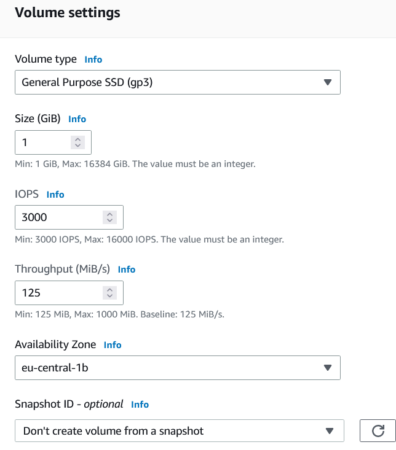

**Exercise 2**

I then proceeded to attach the EBS Volume to my EC2 Instance.
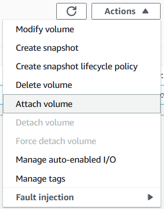

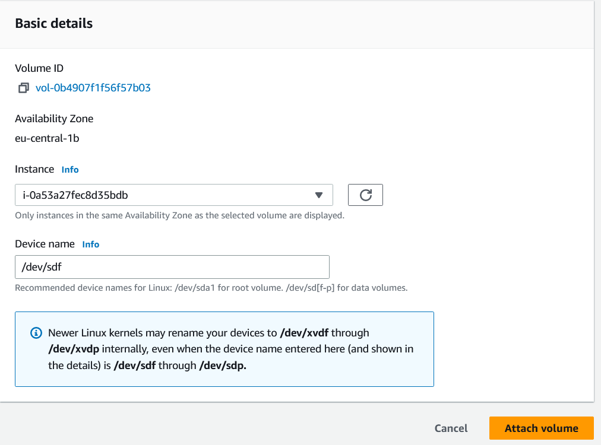

I also successfully connected to my EC2 Instance using ssh.
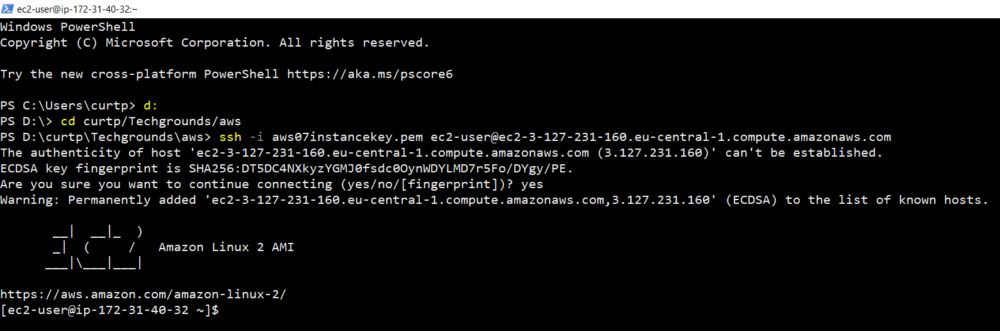

I then did the following steps to mount the EBS volume.

1. Verify that the new EBS volume is attached and visible using the **lsblk** command.
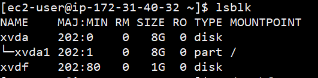

2. Created a file system on the new volume using the command **sudo mkfs -t ext4 /dev/xvdf (replace /dev/xvdf with the device name of your new volume)**.
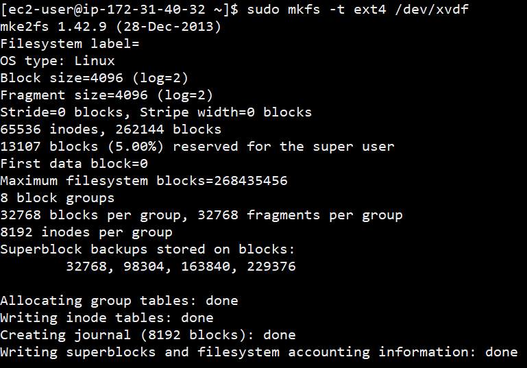

3. Created a directory to serve as the mount point for the new volume using the command **sudo mkdir /mnt/newvolume**.
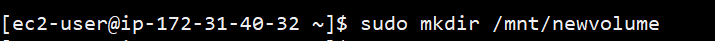

4. Mounted the new volume to the mount point using the command **sudo mount /dev/xvdf /mnt/newvolume (again, replace /dev/xvdf with the device name of your new volume)**.

5. Verified that the new volume is mounted correctly by running the command **df -h** and looking for the mount point I just created.
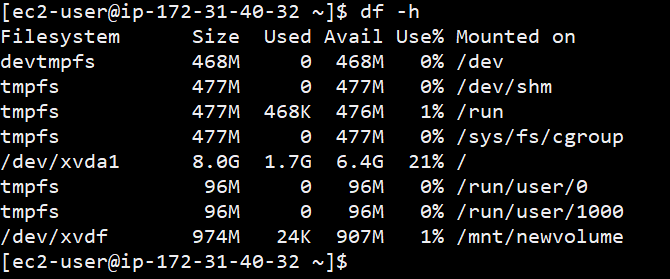

I then proceeded to create text files in the EBS Volume directory.
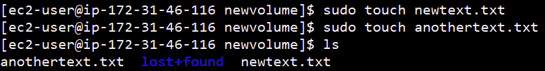

**Exercise 3**

I created a snapshot of my EBS volume
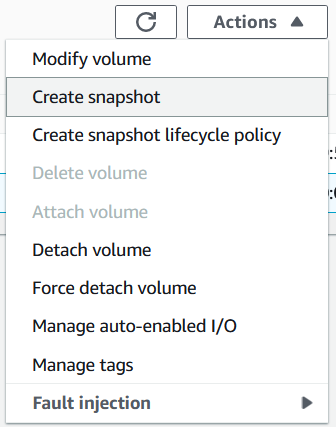

And proceeded to remove the text files from the original.
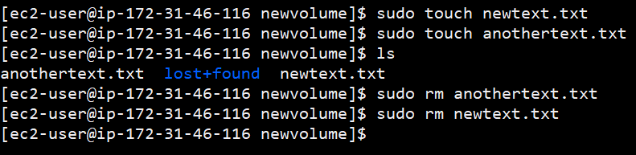

I then created a new volume using my snapshot
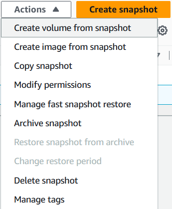

And then detched the original EBS volume
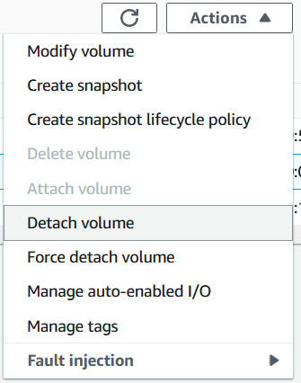

I then attached the new EBS volume to my EC2 instance.
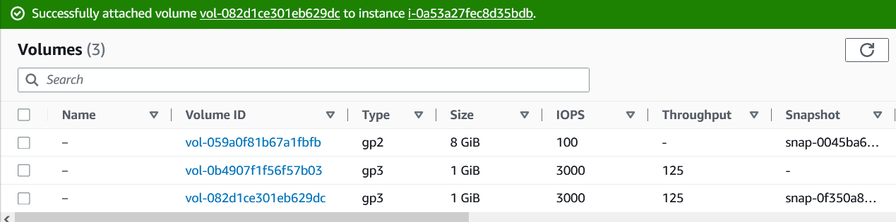

I used the same mounting commands previously used to mount it and was able to successfully find my files.
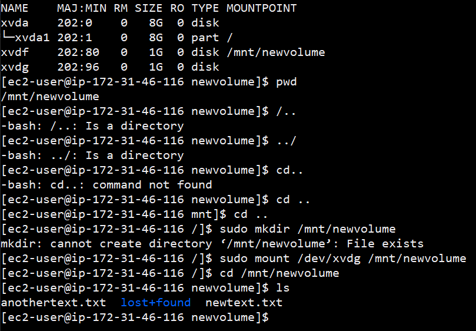
