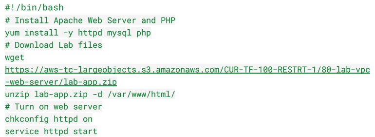
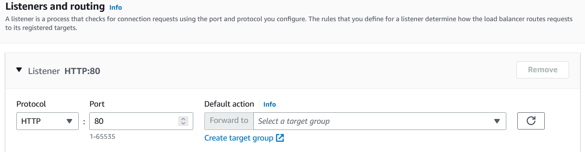

# Elastic Load Balancing (ELB) & Auto Scaling
**AWS Auto Scaling** is a service that automatically adjusts the amount of computing resources, such as servers or virtual machines, in response to changes in demand.

It works by setting up rules that define the minimum and maximum number of resources that should be available to handle incoming requests. When demand increases, the service automatically adds more resources, and when demand decreases, it removes them.

**AWS Elastic Load Balancing (ELB)** is a service that distributes incoming network traffic across multiple servers or instances in a way that maximizes efficiency and minimizes downtime.

It works by creating a single endpoint or domain name to receive traffic, and then automatically routing that traffic to one or more servers based on various criteria such as server availability, traffic volume, and response times.

ELB can handle traffic for multiple applications or services, and it can automatically scale to meet demand by adding or removing servers as needed.

## Key-terms
**CloudWatch**

AWS CloudWatch is a monitoring service that provides real-time insights into the performance and health of your AWS resources, including servers, applications, and databases.

**CloudWatch Metrics**

CloudWatch Metrics are data points that are collected and sent to CloudWatch for analysis and visualization. These data points can include information such as CPU usage, network traffic, and disk utilization.

Once these metrics are collected, CloudWatch provides various tools for analyzing and visualizing the data, including graphs, dashboards, and alarms.

With CloudWatch Metrics, you can track the performance of your resources over time, identify trends and patterns, and set up alerts to notify you when certain metrics exceed predefined thresholds. This helps you to proactively manage your resources and avoid potential issues before they impact your applications or services.

**Application Load Balancer (ALB)**

AWS Application Load Balancer (ALB) is a service that distributes incoming network traffic to multiple targets, such as EC2 instances, containers, or Lambda functions, based on rules that you define.

ALB works by creating a single endpoint or domain name to receive traffic, and then using a set of rules to route that traffic to specific targets. These rules can be based on various factors, such as the content of the request, the source IP address, or the type of SSL/TLS certificate used.

When an incoming request arrives at the ALB, it examines the request and matches it against the defined rules to determine the appropriate target. The request is then forwarded to the target, and the response is returned to the client.

ALB can also perform various other functions, such as SSL/TLS termination, content-based routing, and HTTP/2 support. It can also integrate with other AWS services, such as CloudWatch and Auto Scaling, to provide additional functionality and scalability.

Overall, ALB helps to ensure that incoming traffic is distributed evenly across available resources, and that applications remain highly available and responsive even under heavy loads.

**Network Load Balancer (NLB)**

AWS Network Load Balancer (NLB) is a service that distributes incoming network traffic to multiple targets, such as EC2 instances or containers, based on rules that you define.

NLB works at the transport layer (Layer 4) of the OSI model and is designed to handle high levels of traffic with low latency. It is ideal for use cases where performance is critical, such as for TCP and UDP traffic, as well as for handling millions of requests per second.

When an incoming request arrives at the NLB, it examines the request and matches it against the defined rules to determine the appropriate target. Unlike an Application Load Balancer (ALB), which operates at the application layer (Layer 7), NLB does not modify the request or response headers, which can help to reduce latency and improve performance.

NLB can also perform various other functions, such as SSL/TLS termination, cross-zone load balancing, and source IP preservation. It can also integrate with other AWS services, such as CloudWatch and Auto Scaling, to provide additional functionality and scalability.

Overall, NLB helps to ensure that incoming traffic is distributed evenly across available resources, and that applications remain highly available and responsive even under heavy loads.

**Classic Load Balancer (CLB)**

AWS Classic Load Balancer (CLB) is a service that distributes incoming network traffic to multiple targets, such as EC2 instances or containers, based on rules that you define.

CLB works at the application layer (Layer 7) of the OSI model and is designed to handle HTTP/HTTPS traffic. It can route requests to different targets based on the content of the request, the source IP address, or the type of SSL/TLS certificate used.

When an incoming request arrives at the CLB, it examines the request and matches it against the defined rules to determine the appropriate target. The request is then forwarded to the target, and the response is returned to the client.

CLB can also perform various other functions, such as SSL/TLS termination, cross-zone load balancing, and session persistence. It can also integrate with other AWS services, such as CloudWatch and Auto Scaling, to provide additional functionality and scalability.

Overall, CLB helps to ensure that incoming traffic is distributed evenly across available resources, and that applications remain highly available and responsive even under heavy loads.

**Gateway Load Balancer (GWLB)**

AWS Gateway Load Balancer (GWLB) is a service that provides a scalable and highly available gateway for routing traffic to resources inside an Amazon Virtual Private Cloud (VPC).

GWLB works by creating a virtual gateway that can route traffic to one or more targets, such as EC2 instances, containers, or Lambda functions, based on rules that you define. It can handle traffic for various protocols, including TCP, UDP, and HTTP/HTTPS.

When an incoming request arrives at the GWLB, it examines the request and matches it against the defined rules to determine the appropriate target. The request is then forwarded to the target, and the response is returned to the client.

GWLB can also perform various other functions, such as SSL/TLS termination, content-based routing, and integration with other AWS services, such as CloudWatch and Auto Scaling, to provide additional functionality and scalability.

Overall, GWLB helps to ensure that incoming traffic is distributed evenly across available resources in your VPC, and that your applications remain highly available and responsive even under heavy loads. It can also help to improve security by providing a central point of entry into your VPC, with features such as network ACLs and VPC endpoint policies.

## Opdracht
**Exercise 1**

- Launch an EC2 instance with the following requirements:
1. Region: Frankfurt (eu-central-1)
2. AMI: Amazon Linux 2
3. Type: t3.micro
4. User data:

5. Security Group: Allow HTTP
- Wait for the status checks to pass.
- Create an AMI from your instance with the following requirements:
1. Image name: Web server AMI

**Exercise 2**

- Create an application load balancer with the following requirements:
1. Name: LabELB
2. Listener: HTTP on port 80
3. AZs: eu-central-1a and eu-central-1b
4. Subnets: must be public
5. Security Group: 
Name: ELB SG
Rules: allow HTTP access
6. Target Group:
Name: LabTargetGroup
Targets: to be registered by Auto Scaling
  
**Exercise 3**

- Create a launch configuration for the Auto Scaling group. It has to be identical to the server that is currently running.
- Create an auto scaling group with the following requirements:
1. Name: Lab ASG
2. Launch Configuration: Web server launch configuration
3. Subnets: must be in eu-central-1a and eu-central-1b
4. Load Balancer: LabELB
5. Group metrics collection in CloudWatch must be enabled
6. Group Size:
Desired Capacity: 2
Minimum Capacity: 2
Maximum Capacity: 4
7. Scaling policy: Target tracking with a target of 60% average CPU utilisation

**Exercise 4**

- Verify that the EC2 instances are online and that they are part of the target group for the load balancer.
- Access the server via the ELB by using the DNS name of the ELB.
- Perform a load test on your server(s) using the website on your server to activate auto scaling. There might be a delay on the creation of new servers in your fleet, depending on the settings on your Auto Scaling Group.

### Gebruikte bronnen
ChatGPT

https://docs.aws.amazon.com/autoscaling/ec2/userguide/autoscaling-load-balancer.html

### Ervaren problemen
No actual problem. Just need to take time to get used to the process

### Resultaat
**Exercise 1**

I created the EC2 Instance with the specified configurations. And created an AMI from it.

**Exercise 2**

I proceeded to create a application load balancer, with the specified configurations.

I also made sure that the subnets are public by placing them in a public route table.

**Exercise 3**

I proceeded to create a launch configuration for the Auto Scaling group.

I then created the Auto Scaling Group, with the specified requirements.

**Exercise 4**

I verified that the EC2 instances are online and that they are part of the target group for the load balancer.

I accessed the server via the ELB by using the DNS name of the ELB and started the Load tests.

I then observed as a new instance was made because of the load test.

Below you will see that a third instance appeared in the eu-central-1b AZ.

