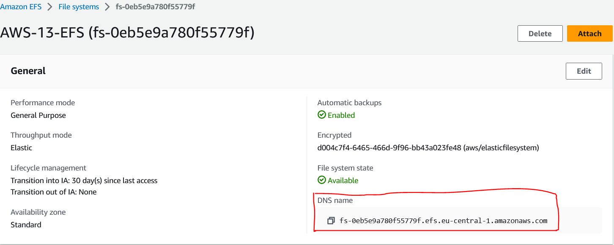
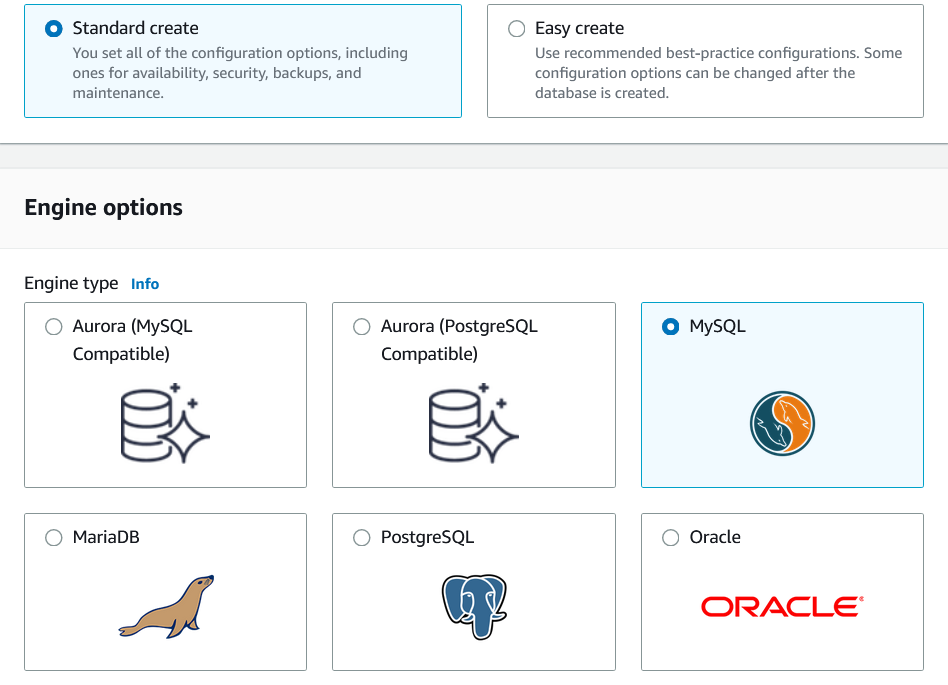

# EFS,Elastic Beanstalk,CloudFront,Route53,RDS,Aurora
These are a combination of topics we will have to learn for this course.

**Theoretical Level**

Elastic Beanstalk, CloudFront and Route53 

**Practical Level**

EFS, RDS and Aurora

## Key-terms
**Elastic Beanstalk**

Elastic Beanstalk is a Platform as a Service (PaaS) offering by Amazon Web Services (AWS) that makes it easy for developers to deploy and manage web applications. It automates the process of provisioning, deploying, and scaling web applications in a variety of programming languages like Java, Python, Ruby, Node.js, PHP, and .NET. Developers can simply upload their application code to Elastic Beanstalk, and it takes care of the rest. Elastic Beanstalk supports multiple deployment options including Docker containers, Java applications, and .NET applications.

**CloudFront**

Amazon CloudFront is a Content Delivery Network (CDN) offered by AWS that helps to accelerate the delivery of static and dynamic web content, including video, audio, images, and other files. CloudFront caches content in edge locations around the world, reducing latency and increasing the speed at which content is delivered to users. It also offers advanced security features, such as SSL/TLS encryption, access control, and DDoS protection.

**Route53**

Amazon Route 53 is a highly scalable Domain Name System (DNS) service offered by AWS. It helps to route traffic to internet resources like web applications, APIs, and other AWS services. It offers a range of features such as domain registration, DNS management, traffic routing, health checks, and DNS failover. With Route53, users can create custom domain names and map them to their AWS resources or on-premises infrastructure.

**EFS**

Amazon Elastic File System (EFS) is a fully managed file storage service offered by AWS that provides scalable and highly available shared file storage for Amazon EC2 instances. EFS supports the Network File System (NFS) protocol and provides a file system interface, file locking, and concurrent access. It is designed to be highly available, durable, and scalable, and can be accessed from multiple EC2 instances simultaneously.

**RDS**

Amazon Relational Database Service (RDS) is a managed database service offered by AWS that provides an easy way to set up, operate, and scale a relational database in the cloud. RDS supports popular database engines like MySQL, PostgreSQL, Oracle, Aurora and SQL Server, and provides features like automated backups, automatic software patching, and high availability. With RDS, users can focus on their applications without worrying about database management tasks.

**Aurora**

Amazon Aurora is a MySQL and PostgreSQL-compatible relational database engine offered by AWS. It is a fully managed database service that is designed to be highly available, durable, and scalable. Aurora provides a high-performance database engine with built-in automatic failover, data replication, and backup and recovery features. It also offers features like read replicas, Multi-AZ deployments, and Global Database for high availability and global scale. Aurora is a popular choice for enterprise workloads that require high performance, scalability, and availability.

## Opdracht
**Part 1**
- Study Theoretically About
1. Elastic Beanstalk
2. CloudFront
3. Route53

**Part 2.1**
- Find the EFS service one AWS.
- Create an EFS filesystem.
- Integrate your EFS filesystem with another service.
1. Create a SG called "AWS-13-EFS-SG" and give it a description of "EFS Access".

    Inbound Rule 1: Allow SSH from anywhere.

    Inbound Rule 2: Allow NFS with the SG as custom source. (This must be added after making the SG first)
2. Create a Amazon Linux 2023 AMI EC2 Instance.

    A subnet in: EU-Central-1a.

    SG: AWS-13-EFS-SG

    Key Pair: None

3. Create a Amazon Linux 2023 AMI EC2 Instance.

    A subnet in: EU-Central-1b.

    SG: AWS-13-EFS-SG

    Key Pair: None
- Mount the EFS to your two instances using EC2 instance connect.

**Part 2.2**
- Find the RDS service one AWS.
- Create a RDS database (MySQL).
- Add a RDS Read Replica
- Connect a EC2 Instance to the database

### Gebruikte bronnen
ChatGPT

Udemy Courses

### Ervaren problemen
[Geef een korte beschrijving van de problemen waar je tegenaan bent gelopen met je gevonden oplossing.]

### Resultaat
**Part 1.1**

**What is Elastic Beanstalk for?**

Elastic Beanstalk is a fully-managed service by AWS that makes it easy for developers to deploy and manage web applications. It abstracts away the infrastructure details and allows developers to focus on their code. With Elastic Beanstalk, you can deploy applications in a variety of programming languages like Java, Python, Ruby, Node.js, PHP, and .NET.

**How is Elastic Beanstalk used in an on-premises setting?**

Elastic Beanstalk is primarily designed for cloud-based deployment, but it can also be used on-premises through the use of an on-premises version of the service called "AWS Outposts." AWS Outposts is a fully managed service that brings AWS infrastructure and services to virtually any data center, co-location space, or on-premises facility.

**How can I combine Elastic Beanstalk with other AWS services?**

Elastic Beanstalk can be easily combined with other AWS services to provide a complete solution for your application needs. For example, you can use Amazon RDS with Elastic Beanstalk to store your application's data, Amazon S3 to store static assets like images and videos, Amazon CloudFront to deliver content to users, and Amazon Route 53 to manage DNS and routing.

**What is the difference between Elastic Beanstalk and its leading competitors?**

Elastic Beanstalk's main competitors are other PaaS offerings like Heroku and Google App Engine. The main difference between Elastic Beanstalk and its competitors is that Elastic Beanstalk is designed to work with a variety of programming languages, whereas Heroku and Google App Engine are more focused on specific languages. Additionally, Elastic Beanstalk provides more control over the underlying infrastructure, making it a good choice for more complex applications.

**Part 1.2**

**What is CloudFront for?**

Amazon CloudFront is a Content Delivery Network (CDN) offered by AWS that helps to accelerate the delivery of static and dynamic web content, including video, audio, images, and other files. CloudFront caches content in edge locations around the world, reducing latency and increasing the speed at which content is delivered to users. It also offers advanced security features, such as SSL/TLS encryption, access control, and DDoS protection.

**How is CloudFront used in an on-premises setting?**

CloudFront is primarily designed for cloud-based deployment, but it can also be used on-premises through the use of a private CDN solution called "AWS Outposts." AWS Outposts is a fully managed service that brings AWS infrastructure and services to virtually any data center, co-location space, or on-premises facility.

**How can I combine CloudFront with other AWS services?**

CloudFront can be easily combined with other AWS services to provide a complete solution for your content delivery needs. For example, you can use Amazon S3 with CloudFront to store and deliver content like images and videos, Amazon EC2 to serve dynamic content, and AWS Lambda to execute custom code before or after serving content. You can also use Amazon Route 53 with CloudFront to manage DNS and routing.

**What is the difference between CloudFront and its leading competitors?**

CloudFront's main competitors are other CDNs like Akamai, Cloudflare, and Fastly. The main difference between CloudFront and its competitors is that CloudFront is integrated with the AWS ecosystem, which makes it easy to use with other AWS services. Additionally, CloudFront offers pay-as-you-go pricing and no upfront fees, which makes it more cost-effective for smaller businesses. Finally, CloudFront offers a wider range of edge locations than its competitors, which means that content can be delivered faster to more locations around the world.

**Part 1.3**

**What is Route53 for?**

Amazon Route 53 is a highly available and scalable Domain Name System (DNS) web service offered by AWS that translates human-readable domain names into IP addresses. It helps to route end-users to internet applications, such as websites, by translating domain names into IP addresses that computers can understand. It also offers advanced features like health checks and traffic management.

**How is Route53 used in an on-premises setting?**

Route 53 is primarily designed for cloud-based deployment, but it can also be used on-premises through the use of a hybrid cloud solution called "AWS Outposts." AWS Outposts is a fully managed service that brings AWS infrastructure and services to virtually any data center, co-location space, or on-premises facility.

**How can I combine Route53 with other AWS services?**

Route 53 can be easily combined with other AWS services to provide a complete solution for your domain name and traffic management needs. For example, you can use Route 53 with Amazon EC2 to route traffic to your web applications, Amazon S3 to route traffic to your static websites, Amazon CloudFront to manage DNS and routing for your content delivery network, and AWS Lambda to execute custom code before or after routing traffic.

**What is the difference between Route53 and its leading competitors?**

Route 53's main competitors are other DNS web services like Google Cloud DNS and Cloudflare DNS. The main difference between Route 53 and its competitors is that Route 53 is tightly integrated with the AWS ecosystem, which makes it easy to use with other AWS services. Additionally, Route 53 offers a global network of DNS servers and traffic management capabilities, which means that it can route traffic to the closest available resource for faster performance. Finally, Route 53 offers advanced features like health checks, failover, and latency-based routing, which make it a good choice for high-availability and performance-critical applications.

**Part 2.1**

After doing a search in the search bar I found AWS EFS

I then proceeded to create an EFS Filesystem

On the EFS "Network" section you can see the available mount targets.

We can also see the EFS DNS Name which we will need later, to be able to mount our instance to it.

In order to integrate the EFS filesystem with my EC2 Instances I took the following steps.

I proceeded to create a Security Group with an Inbound rule to allow SSH from anywhere.

In order to secure the NFS to the Security Group itself. I had to save the security group first, then edit it, choose NFS as a inbound rule and pick the security group as the source. This security group will be attached to the EC2 Instances and the EFS Filesystem.

I created two EC2 Instances and made sure one has a public subnet in eu-central-1a and the other in eu-central-1b.

In order to mount the EC2 Instances to the EFS I took the following steps:

I connected to both Instances using Instance Connect.

Instance 1

Instance 2

I then proceeded to make sure the Instances are up to date by using the following command

**sudo yum -y update**

I then proceeded to make a directory for the EFS mount point using the following command.

**mkdir ~/efs-mount-point**

I then installed EFS Utils on both instances by using the following command

**sudo yum install -y amazon-efs-utils**

I then went to the EFS Filesystem, clicked on the "Network" option and then clicked on "Manage", to edit the mount points.

I removed the AZ that the instances are not on and proceeded to delete the default Security Group and then attached the Security Group I made, to the Subnets.

I then used the following command with the DNS name of the EFS Filesystem to mount the EFS to both instances.

**sudo mount -t efs -o tls fs-0eb5e9a780f55779f.efs.eu-central-1.amazonaws.com:/ ~/efs-mount-point**

I then created a new directory and a text file in the efs-mount-point directory on Instance 1

So now when I checked on Instance 2 by doing the "ls" command. I was able to see the files on Instance 2, indicating a successful file sharing.

**Part 2.2**

I found the RDS service on AWS and proceeded to make a MySQL database with the following settings:

I chose not to make the EC2 connection option now, just so I can perform it manually later.

I picked the SG I made earlier in order to allow SSH connections and a Aurora/MySQL connection from all instances within that security group.

 

Here is just an example of how the security group Inbound rule was setup.

Here is just a quick view of the process IF I hade chosen to connect to an EC2 instance right away while creating the database.

After connecting to my EC2 Instance using Instance Connect, I started the process of updating the instance.

After the update procedure I installed MySQL on my Instance.

I then proceeded to use the correct command to make connection to my database via my EC2 instance.

