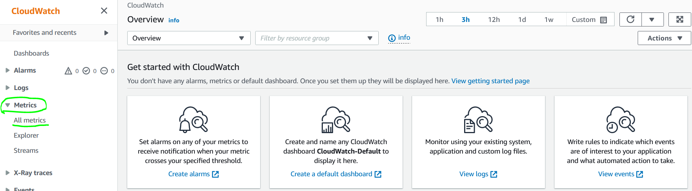
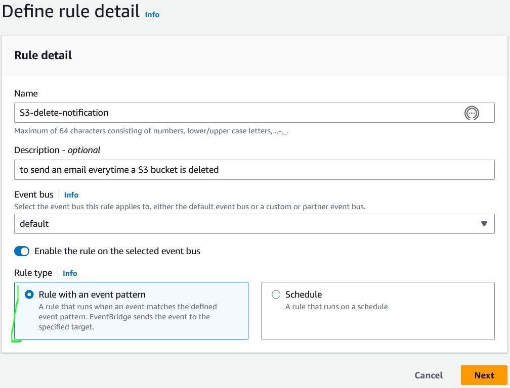

# Cloud Fundamentals
This will have several different cloud fundamental services.

## Key-terms
*Theory Topics*

**Elastic Container Service (ECS)**

Amazon Elastic Container Service (ECS) is a fully managed container orchestration service that simplifies the deployment and management of Docker containers on Amazon Web Services (AWS). ECS enables users to launch, manage, and scale Docker containers using AWS infrastructure, including EC2 instances, Elastic Load Balancing, and Amazon Elastic Container Registry (ECR). ECS also integrates with AWS Fargate, a serverless compute engine that allows users to run containers without having to manage the underlying infrastructure.

ECS provides a number of benefits, including high availability and scalability, flexible scheduling options, and support for a wide range of container applications. Compared to its biggest competitor, Kubernetes, ECS is considered to be easier to use and more straightforward to set up, although it may not be as feature-rich or customizable.

**AWS Support Plans**

AWS Support Plans are a set of subscription-based support options that provide AWS customers with access to technical support, guidance, and tools for optimizing their AWS infrastructure. AWS offers several support plans, including Basic, Developer, Business, and Enterprise, each with varying levels of support and pricing.

AWS Support Plans provide users with a variety of benefits, including 24/7 access to AWS experts, personalized support, and access to AWS Trusted Advisor and AWS Infrastructure Event Management. AWS Support also offers several additional services, including AWS Infrastructure Event Management, which provides personalized recommendations for improving infrastructure performance and reducing costs.

Compared to its competitors, AWS Support is known for its comprehensive and responsive customer service, although some users may find the pricing to be higher than other support options.

**AWS Trusted Advisor**

AWS Trusted Advisor is a tool that provides users with personalized recommendations for optimizing their AWS infrastructure in four key areas: cost optimization, security, fault tolerance, and performance improvement. Trusted Advisor analyzes users' AWS infrastructure and provides recommendations based on best practices and AWS guidelines.

Trusted Advisor provides a number of benefits, including cost savings, increased security and compliance, and improved infrastructure performance. Trusted Advisor is also fully integrated with AWS Support Plans, allowing users to access personalized support and guidance based on Trusted Advisor recommendations.

Compared to its competitors, Trusted Advisor is considered to be a highly effective tool for optimizing AWS infrastructure, although some users may find the recommendations to be overly conservative or conservative in nature.

**AWS Config**

AWS Config is a service that enables users to assess, audit, and evaluate the configuration of their AWS infrastructure resources. AWS Config provides users with a detailed inventory of their AWS resources, including configuration history, resource relationships, and resource dependencies.

AWS Config provides a number of benefits, including improved compliance and security, resource configuration tracking, and change management. AWS Config also integrates with AWS CloudTrail, enabling users to track and audit changes to their AWS resources.

Compared to its competitors, AWS Config is considered to be a highly effective tool for managing AWS infrastructure, although some users may find the learning curve to be steeper than other configuration management tools.

**AWS CloudTrail**

AWS CloudTrail is a service that provides users with a detailed record of API calls and events in their AWS account. CloudTrail records events such as resource creation, deletion, and modification, as well as API calls made by users and AWS services.

CloudTrail provides a number of benefits, including improved compliance and security, auditing and troubleshooting, and change management. CloudTrail also integrates with other AWS services, including AWS Config and AWS CloudWatch.

Compared to its competitors, CloudTrail is considered to be a highly effective tool for auditing and troubleshooting AWS infrastructure, although some users may find the pricing to be higher than other logging and monitoring options.

**IAM (Identity and Access Management)**

AWS IAM (Identity and Access Management) is a service that helps you control access to AWS resources. IAM allows you to manage users and their access to AWS resources, including services, applications, and data. You can use IAM to create and manage user accounts, groups, and roles, and set permissions to control access to AWS resources.

IAM integrates with other AWS services, such as AWS S3, EC2, and RDS, to provide granular control over access to resources and help you meet compliance requirements.

**AWS CloudWatch**

AWS CloudWatch is a monitoring and management service provided by Amazon Web Services (AWS) that helps you monitor and manage your AWS resources and applications in real-time. CloudWatch collects and stores metrics and logs, and provides you with actionable insights to help you troubleshoot issues, identify trends, and optimize your applications and infrastructure.

CloudWatch works with a wide range of AWS services, including EC2, Lambda, RDS, S3, and more.

**DynamoDB**

Amazon DynamoDB is a fully managed NoSQL database service provided by Amazon Web Services (AWS). It provides a fast, scalable, and reliable way to store and retrieve data in the cloud.

DynamoDB is designed to handle any level of traffic, from a few requests per second to millions of requests per second, and can scale up or down automatically to accommodate changing workloads. It provides low latency and high throughput for read and write operations, making it well-suited for applications that require fast and predictable performance.

DynamoDB works with a wide range of AWS services, including Lambda, S3, Kinesis, and more.It provides a flexible data model that allows you to store and retrieve any amount of data, of any type, and in any format. You can also use DynamoDB to build applications that require real-time data updates, such as chat applications or real-time analytics.

**AWS Lambda**

AWS Lambda is a serverless computing service provided by Amazon Web Services (AWS). It allows you to run your code without provisioning or managing servers, making it easier to build scalable, event-driven applications.

With Lambda, you simply upload your code and specify the events that trigger it. Lambda automatically scales your application and handles all the underlying infrastructure, including server and operating system maintenance, patching, and capacity provisioning.

Lambda works with a wide range of AWS services, including S3, DynamoDB, API Gateway, and more. It can be used to build a variety of serverless applications, such as data processing pipelines, event-driven workflows, and mobile and web backends.

**SNS (Simple Notification Service)**

Amazon SNS (Simple Notification Service) is a fully managed messaging service provided by Amazon Web Services (AWS). It allows you to send and receive messages to and from multiple recipients or subscribers, using a variety of communication protocols.

With SNS, you can send messages to multiple recipients or subscribers, including email, SMS, mobile push notifications, and more. You can also use SNS to trigger events in other AWS services, such as Lambda functions or S3 buckets.

SNS works with a wide range of AWS services, including Lambda, S3, CloudFormation, and more. It can be used to build a variety of applications, such as mobile and web applications, event-driven architectures, and messaging systems.

**SQS (Simple Queue Service)**

Amazon SQS (Simple Queue Service) is a fully managed message queuing service provided by Amazon Web Services (AWS). It enables you to decouple and scale microservices, distributed systems, and serverless applications.

With SQS, you can send, store, and receive messages between software components at any volume, without losing messages or requiring other services to be available. SQS offers both standard and FIFO queues with high availability, durability, and scalability.

SQS works with a wide range of AWS services, including Lambda, EC2, ECS, and more. It can be used to build a variety of distributed systems, such as message-driven architectures, event-driven systems, and batch processing workflows.

**EventBridge**

Amazon EventBridge is a serverless event bus service provided by Amazon Web Services (AWS). It makes it easy to build event-driven architectures by allowing you to route events between AWS services, third-party SaaS applications, and your own custom applications.

With EventBridge, you can create event rules that match incoming events and route them to one or more targets. You can use EventBridge to integrate with a variety of AWS services, such as Lambda, SNS, SQS, and more, as well as third-party SaaS applications, such as Zendesk, PagerDuty, and more.

## Opdracht
**IAM Excercise**

- Create a new user called Johnny.
- Create a new group that is only allowed to access S3 buckets.
- Place Johnny in that group.
- Show proof it worked.

**CloudWatch Excercise**

- Create a EC2 Instance.
- Install a CloudWatch Agent on your EC2 Instance.
- Monitor the CPU usage metrics of your EC2 Instance.
- Set an alarm to alert you when the CPU usage is equal or greater than 70%.
- Show proof that the alarm is functioning properly

**DynamoDB Excercise**

- Create a DynamoDB table.
- Add items to your table.
- Replicate your table into another region

**AWS Lambda Excercise**

- Create a Lambda function that will be triggered everytime you upload a file into a S3 bucket.

**SQS Excercise**

- Create an SQS queue
- Create, send and poll two messages using SQS to show how the concept works.

**SNS Excercise**

- Create an SNS
- Use that SNS to send a message to your SQS and email.

**EventBridge Excercise**

- Create a rule in EventBridge that everytime a S3 bucket is deleted, it will send you an email.

### Gebruikte bronnen
**For the stress installation**

https://www.cyberciti.biz/faq/installing-rhel-epel-repo-on-centos-redhat-7-x/

**For the CloudWatch agent installation**

https://docs.aws.amazon.com/AmazonCloudWatch/latest/monitoring/install-CloudWatch-Agent-on-EC2-Instance.html

ChatGPT

https://www.youtube.com/watch?v=OJrxbr9ebDE

### Ervaren problemen
[Geef een korte beschrijving van de problemen waar je tegenaan bent gelopen met je gevonden oplossing.]

### Resultaat
**IAM Excercise**

I started off by going to the IAM console and clicking on user and then the add user button.

I then proceeded to add the user name, created a password for him and chose that he does not need to change the password after login, because he is me and this is a test.

After making the user I choose the option to set him in a group and then proceeded to make that new group which will only have access to S3.

I then logged in using the newly created user.

I attempted to access EC2 and create an instance but was immediately shown that this was not possible with this user.

I then tried to access S3 and was able to do all the tasks within S3.

**CloudWatch Excercise**

I created an Amazon Linux 2 EC2 instance and connected to it via instance connect.

I then went to CLoudWatch to view the metrics of my EC2 Instance. I went to "Metrics" and then selected "All Metrics"

I then chose the EC2 service, seeing I want to monitor my EC2's CPU.

I chose the "Per Instance Metrics".

I then looked up the Instance name and selected CPUUtilization.

I then proceeded to setup the alarm option.

I chose the option to send me an e-mail when the alarm hits.

I then proceeded to do a stress test on my instance's CPU. To see if the alarm is triggered. And after a minute I saw an alarm notification.

I checked the graph and it showed it passing the bar.

I also checked my e-mail and did receive the Alarm notification.

**AWS Lambda Excercise**

I created a Lambda function and picked the Amazon S3 object read only permissions AWS policy template.

I then set the trigger by choosing the S3 application and making the trigger event "PUT" to indicate that it should trigger everytime I put something in my S3 bucket.

In order to check if the triggered functioned properly I went to the Lambda monitor tab and chose "View CLoudWatch logs"

I was then able to see that the event indeed triggered my Lambda function.

**SQS Excercise**

You search for SQS and then click on the create queue button. I named the queue "test-sqs" and kept all the settings as default

I then chose the "Send and Receive Messages" option.

The way SQS works is that you send a message into it and it will store it in a queue.

It will then keep those messages in a queue untill they are polled, read and deleted.

As soon as you click to start polling the messages it will pull them out of the queue.

After that you will be able to read them and delete them, which will clear them from the queue.

**SNS Excercise**
I started by creating a topic and choosing the following options.

Type: Standard

Name: SNS_threeway

Display name: SNS_threeway

After creating the topic I then proceeded to create the subscriptions to the topic.

I had to select the topic I want to create the subscription for and also the protocol.

I made one for my email and added it as the endpoint.

I also made one for a SQS I made earlier.

When it comes to the email protocol. I received an email to accept my subscription.

When it came to the SQS I has to choose to subscribe to the SNS topic.

I then proceeded to create the message I wish to send to the subs.

Here is the successfully sent message to my e-mail.

Here is the successfully sent message to my SQS

**EventBridge Excercise**

To create a rule in EventBridge to send me a notification everytime an S3 bucket is deleted, I went to EventBridge and chose "EventBridge Rule".

I created the rule name, added a description of what the rule does and chose the option to "Rule with an event pattern".

I then had to choose the Event source. I picked AWS events because I wanted an event that is triggered by an AWS service. 

