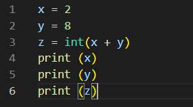
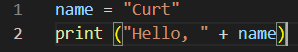
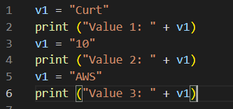

# Variables
A variable can store a value. This value can then be accessed with the variable name in the code. This is useful if you want to use one value multiple times, or if you want to dynamically change the value.

## Key-terms
none

## Opdracht
**Exercise 1**
- Create a new script.
- Create two variables x and y. - Assign a numerical value to both variables.
- Print the values of x and y.
- Create a third variable named z. - The value of z should be the sum of x and y.
- Print the value of z.

**Exercise 2**
- Create a new script.
- Create a variable name. The value of name should be your name.
- Print the text “Hello, (your name here)!”. Use name in the print statement.

**Exercise 3**
- Create a new script.
- Create a variable and assign a value to it.
- Print the text “Value 1: <value 1 here>”.
- Change the value of that same variable.
- Print the text “Value 2: <value 2 here>”.
- Change the value of that same variable.
- Print the text “Value 3: <value 3 here>”.

### Gebruikte bronnen
Udemy Course
ChatGPT
### Ervaren problemen
None

### Resultaat
**Exercise 1**

**Exercise 2**

**Exercise 3**

