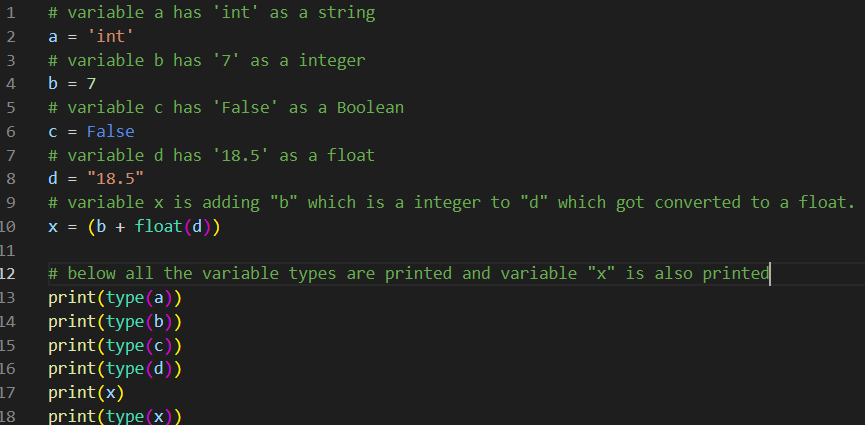
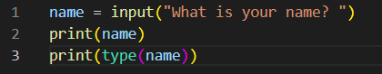
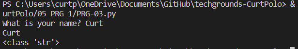
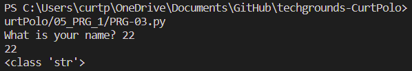

# Data types and comments
Under the hood, a computer can only see strings of zeros and ones. Programming languages make use of data types to tell the computer how to interpret those strings.
For example, when the computer needs to read the binary string 01000001, it will need to know the data type to determine whether it means 65 or “A”.

## Key-terms
**Boolean**

A binary state that is either True or False.
boolean = True

**String**

Technically an array of characters. Strings are denoted using “ ” double quotes or ‘ ’ single quotes.
string = "This is a string"

**Int**

An integer is a whole number. Ints can be both positive and negative.
integer = 6

**Float**

A floating-point number is a decimal number.

floating_point = 18.5

## Opdracht
**Exercise 1**
- Create a new script.
- Copy the code below into your script.

a = 'int'

b = 7

c = False

d = "18.5"
- Determine the data types of all four variables (a, b, c, d) using a built in function.
- Make a new variable x and give it the value b + d. Print the value of x. This will raise an error. Fix it so that print(x) prints a float.

### Gebruikte bronnen
ChatGPT
Udemy

### Ervaren problemen
None

### Resultaat
**Exercise 1**

**Exercise 2**
The input in this case of this code remains a string

