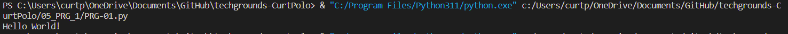

# Setting UP
This is to just setup VS Code to be able to work with Python.

## Key-terms
**IDE (Integrated Development Environment)**

Is a software tool that helps programmers write and create computer programs. It provides a convenient and efficient environment for writing code, testing and debugging programs, and managing software projects.

## Opdracht
- Write the following Python code. The output in the terminal should be the text “Hello world!”
### Gebruikte bronnen
N/A

### Ervaren problemen
None

### Resultaat

