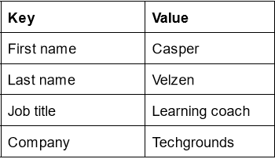

# Key-value pairs
Key-value pairs are a general concept you will definitely encounter. Some examples of where you will find them are NoSQL databases or AWS/Azure resource tags. Dictionaries (dict) in Python also use key-value pairs to store information.

Dicts in Python are written using curly brackets {}. You can get values from the dict by calling its key.

## Key-terms
None

## Opdracht
**Exercise 1**
- Create a new script.
- Create a dictionary with the following keys and values:

- Loop over the dictionary and print every key-value pair in the terminal.

### Gebruikte bronnen
ChatGPT

### Ervaren problemen
None

### Resultaat
Look at PRG-08-01.py

Look at PRG-08-02.py
