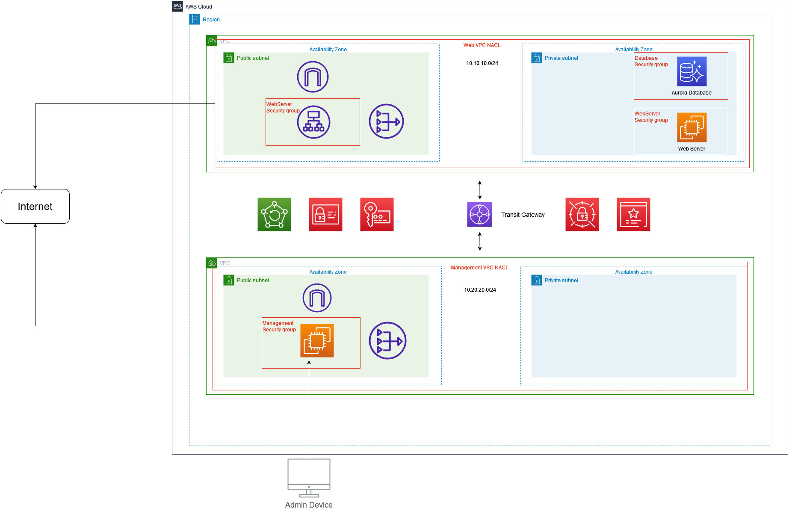

# The Final Project Design

## The final design consists of the following

- One Region (eu-central-1)
- Two VPCs (Web VPC and Management VPC)

**Web VPC**

The web VPC has the following:
- A Aurora Database located on the private subnet
- A EC2 Linux web server that is located on the private subnet
- A NAT Gateway (design point) on the public subnet
- A Application Load Balancer (Proxy) on the public subnet
- A Internet Gateway on the public subnet

**Management VPC**

The management VPC has the following:

- A windows management server on the public subnet
- A Internet Gateway
- A NAT Gateway (design point)
- Can only be accessed by an Admin device

**VPC Connection**

The VPCs are connected via a Transit Gateway

**Additional Needed Services**
- IAM
- AWS Backup
- AWS KMS
- Secrets Manager
- Certificate Manager

