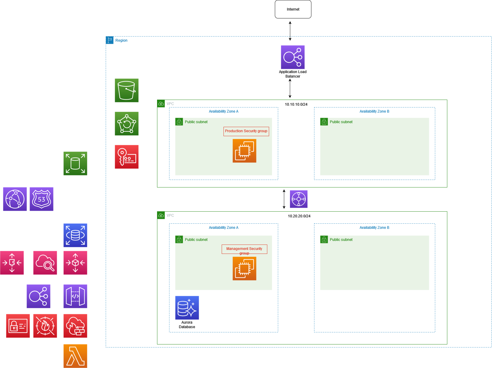

# Stage 1
I decided to go with this base design and add services that I could possibly use on the side at this point.

- I've added an application load balancer between the internet and my Web-Server VPC.
- Both VPCs will be in multiple AZs
- The two VPC will be connected to each other using a transit gateway.

(Please read the decision documentation for explanation on the changes)

